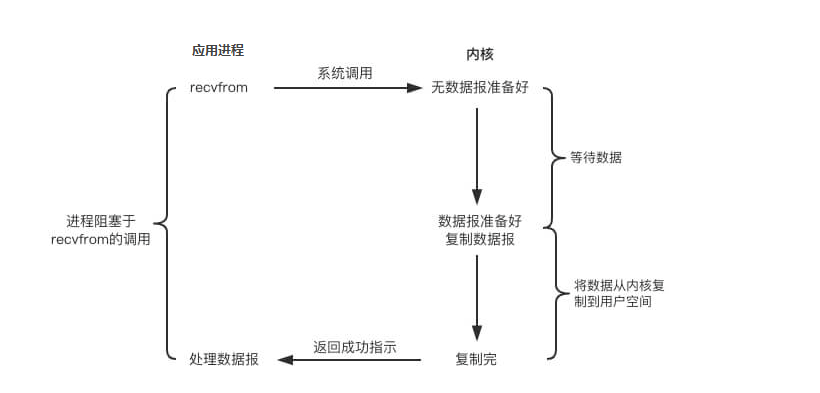
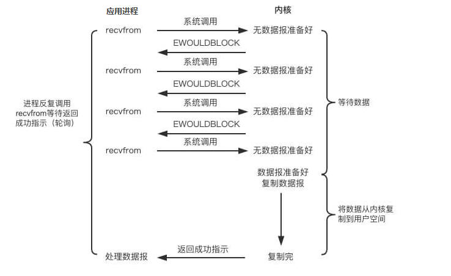

> 因为为了保护操作系统的安全稳定运行，操作系统将内存划分为内核空间和进程空间，继续内存隔离。用户空间无法直接操作内核空间，用户空间无法直接访问内核管理的IO 比如：磁盘和网卡

所以IO对于应用程序来讲，一次IO调用应该包括两个阶段。

- 1.IO调用阶段：应用程序进程向内核发起系统调用。
- 2.IO执行阶段：内核执行IO操作并返回
  - 准备数据阶段：内核等待IO设备准备好数据。
  - 拷贝数据阶段：将数据从内核缓冲区拷贝到用户空间缓冲区

## BIO

应用程序在发起IO调用后至内核 执行IO操作返回结果之前，若发起这个调用的线程一直处于等待状态，这种方式定义为BIO。

如果内核数据需要很久才能准备好，那么用户进程将被阻塞，浪费性能，虽然可以躲开线程来解决这个问题，但是受限于操作系统线程数量的限制和线程上下文切换的开销，第一是并发上不去，第二是开销太大。

## NIO

如果将BIO的阻塞阶段改为非阻塞，就是用户进程发起系统调用的时候非阻塞等待，然后内核接收到请求立即返回，用户线程通过轮询的方式来查看处理的结果，

此种方案虽然减少了阻塞的性能开销，但是频繁的轮询造成了频繁的系统调用，浪费了大量的CPU资源。

### select/poll

SELECT是内核提供的系统调用，支持一次查询多个系统调用的可用状态，当任意一个结果可用时就会返回，此时用户进程再发起一次系统调用就可以从**内核**读取数据。如果连接数量不多的情况下，这种办法不一定就比BIO+多线程来的快。select/epoll的优势并不是对于单个连接能处理得更快，而是在于能处理更多的连接。

和BIO知识一个recvform系统调用比起来，这种方式还多了一个select系统调用。

select的限制在于，连接数量有限制，poll相比于select，主要是解决了连接的限制。

## 异步IO

异步IO在于用户进程发起read请求，立即返回。内核不仅仅会等待数据准备完成，还会将数据拷贝到用户内存，然后再通知用户来读取数据。这种方案有一个缺点就是每一个请求都是要预先分配一块内存来用于将来内核提前拷贝数据。不适用于一些又轻量又多的连接。

### select/poll  epoll的区别

select，poll，epoll都是IO多路复用的机制。I/O多路复用就是通过一种机制，一个进程可以监视多个描述符，一旦某个描述符就绪（一般是读就绪或者写就绪），能够通知程序进行相应的读写操作。但select，poll，epoll本质上都是同步I/O，因为他们都需要在读写事件就绪后自己负责进行读写，也就是说这个读写过程是阻塞的，而异步I/O则无需自己负责进行读写，异步I/O的实现会负责把数据从内核拷贝到用户空间。

**select poll**

select目前几乎在所有的平台上支持，其良好跨平台支持也是它的一个优点。select的一 个缺点在于单个进程能够监视的文件描述符的数量存在最大限制，在Linux上一般为1024，可以通过修改宏定义甚至重新编译内核的方式提升这一限制，但 是这样也会造成效率的降低。(一次轮询更多了是吧)

poll没有大小的限制。

select 和 poll 速度都比较慢，每次调用都需要将全部描述符从应用进程缓冲区复制到内核缓冲区。

**epoll**

epoll_ctl() 用于向内核注册新的描述符或者是改变某个文件描述符的状态。已注册的描述符在内核中会被维护在一棵红黑树上，通过回调函数内核会将 I/O 准备好的描述符加入到一个链表中管理，进程调用 epoll_wait() 便可以得到事件完成的描述符。

从上面的描述可以看出，epoll 只需要将描述符从进程缓冲区向内核缓冲区拷贝一次，并且进程不需要通过轮询来获得事件完成的描述符。