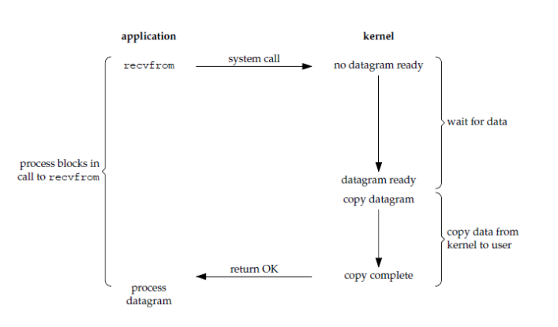
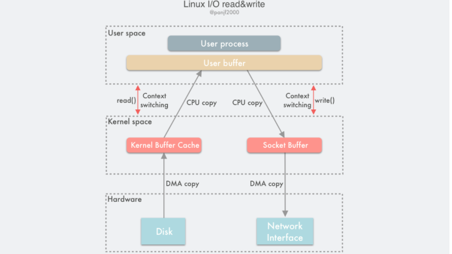
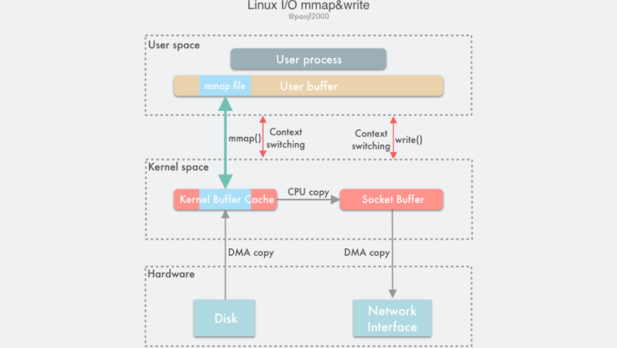

# Linux IO模式和零拷贝

## 预备概念

**内核态和用户态**

首先操作系统将寻址空间划分承了用户空间和内核空间，内核从本质上也是运行的软件，控制系统的硬件资源为上层应用程序提供运行的环境。用户态就是应用程序的运行空间。如果是32为操作系统，最大寻址空间是4GB。1GB内核空间，3GB用户空间。

正是因为操作系统的资源是有限的，如果访问资源的操作过多，而不对操作加以区分，很可能造成资源访问的冲突。所以linux的设计就是对操作划等级区分，划分成了内核态和用户态。与系统有关的一些特别关键的操作必须由最高特权的程序来运行。

内核态的进程可以执行任何操作，而很多程序一开始是运行在用户态的，在需要执行一些需必须要内核权限的操作比如：分配内存，输入输出。一此时需要切换到内核态去执行。

切换到内核态的方式

- 系统调用

用户进程主动发起操作请求切换到内核态，陷入内核之后，由操作系统来操作系统资源，完成之后再返回到进程。

- 异常

被动的操作，用户进程无法预测发生的时机，当用户进程再运行期间发生了异常，这时候会触发由当前运行进程切换到处理该异常的内核相关异常中，也就是切换到了内核态。异常包括：除零异常，缓冲区溢出，缺页。

- 中断

当外围设备完成用户的请求的操作后，会向CPU发出相应的中断信号，此时CPU暂停手上的工作而转到与中断信号相应的处理程序去执行，假设之前执行的是用户态的程序，那么此时转换了自然就是切换到了内核态了。中断包括 IO中断，外部信号中断，定时器等等。

中断和异常类似，都是通过中断向量表来找到相应的处理程序来处理，区别在于，中断来自处理器外部，不是由执行一条命令造成的异常是执行当前指令的结果。

**进程切换**

为了控制进程的执行，内核必须有能力挂起正在CPU上运行的进程，并恢复以前挂起的某个进程的执行。

- 从一个进程到另外一个进程上运行。
- 需要保存处理机上下文，程序计数器和其他寄存器。
- 更新Process Control Block的信息
- 把进程的PCB移入到相应的队列，就绪队列，阻塞队列等等。
- 选择另外一个就进程执行，更新他的PCB。
- 更新内存内存管理的数据结构
- 恢复上下文

**文件描述符**

用于表示指向文件的引用的抽象化的概念。

是一个非负整数，是一个索引值，指向内核为每一个进程所维护的该进程打开文件的记录表，程序打开一个文件或者创建一个新文件，内核向进程返回一个文件描述符。

**缓存IO**

现在默认的IO方式就是缓存IO，数据先从磁盘复制到内核空间的缓冲区，再从内核空间复制到用户空间。

读：操作系统检查内核的缓冲区有没有需要的数据，如果已经缓存了，那么直接读缓存返回，否则从磁盘读取。

写：将数据从用户空间写到内核空间的缓存(page cache)，对于用户进程来说写入已经完成，除非显示的指定一些同步命令。内核将对应的页标记为dirty，添加到dirty list，定期刷磁盘。

优点：

一定程度上分离了内核空间和用户空间，保护系统本身的运行安全。

减少读磁盘的次数，提高性能。

缺点：数据传输过程中需要在用户空间和内核空间进行多次数据拷贝操作 ，数据拷贝操作cpu开销大，还有还有在不同的空间来回搬运，也是设计到用户态内核态的切换。

**直接 IO**

就是应用程序直接访问磁盘的数据而不经过内核缓冲区，目的就是为了减少一次内核缓冲区到用户空间的数据复制开销。比如一些数据库管理系统。

缺点：如果访问你的数据不在应用程序的缓存里面，那么每次数据都要读磁盘，这个时候特别缓慢。一般情况下，CPU处理的数据很有可能是在磁盘连续存储的，尤其是IO的时候，尽管一次处理的数据很小，但是可以将下一条指令的数据提前加载到了内存，就不用再次从磁盘读取了。内存速度远大于磁盘/外存这是大家都知道的。

## 几种IO模型

上面提到了缓冲IO就是默认使用的。数据先被拷贝到内核缓冲区，然后再冲内核缓冲区拷贝到用户空间。所以再次总结一下他的过程。

- 等待数据准备
- 将数据从内核拷贝到用户空间

如果把发起系统调用算进去的话，就还有一个`发起系统调用`。

基于这两个阶段，linux有五种IO模型。

- 阻塞IO	
- 非阻塞IO
- IO多路复用
- 信号驱动IO
- 异步IO

### BIO




在用户进程调用了recvfrom这个系统调用，陷入内核态，内核开始准备数据，此时往往也是需要等待网络或者DMA把数据准备到内核缓冲区，准备完成之后.再从内核空间搬运到用户空间。

所以，BIO，在发起系统调用的时候是阻塞的（他自愿的），在等待数据准备好的时候是阻塞的。


### NIO

如果设置socket为non-blocking,那么操作就是：

应用进程执行系统调用后，内核返回一个错误码，应用进程可以继续执行，但是需要不断的执行系统调用来获知IO是否完成。

由于CPU要处理更多的系统调用，因此这种模型的CPU利用率比较低。

### IO多路复用

select/poll/epoll都属于IO多路复用。好处在于单个进程可以同时处理多个IO，基本原理就是这三个函数回不断的轮询负责所有的socket，当socket有数据到达了，通知用户进程。

调用以上函数的时候，会被阻塞，直到某一套接字可读时才会返回。

如果一个WEB服务器没有IO多路复用，每一个Socket连接都需要创建一个线程去处理，相比于多线程或者多进程技术，IO复用开销更小。

### 信号驱动IO

应用进程调用sigaction系统调用，内核立即返回，应用进程可以继续执行。等待数据阶段应用时非阻塞的，内核在数据到达时向用户进程发送sigio信号，应用进程收到之后在信号处理信号处理程序中调用recvform将数据从内核复制到应用进程。

### 异步IO

应用进程执行aio_read系统调用会立即返回，应用进程可以继续执行，不会被阻塞，内核会在所有操作完成之后向应用进程放信号。

咋一看和信号驱动没区别啊，AIO的信号时通知应用进程IO完成，信号驱动IO时通知你可以来搬砖了。

### IO模型的比较

**定义**

> 同步IO：将数据从内核缓冲区复制到应用进程缓冲区的阶段，应用进程会阻塞
>
> 异步IO：从内核缓冲区拷贝到引用进程缓冲区时不会阻塞。

根据以上的定义，同步IO包括BIO,NIO,IO多路复用，和信号驱动IO。他们的主要区别时第一阶段，就是如何等待数据准备好。

NIO，信号驱动IO,异步IO在第一阶段都不会阻塞。

### IO复用

select/poll/epoll都是IO多路复用的实现，select出现的最早，然后是poll,epoll.

**select**

```c
int select(int n, fd_set *readfds, fd_set *writefds, fd_set *exceptfds, struct timeval *timeout);
```

select允许程序监视一组文件描述符，等待一个或者多个描述符成为就绪状态，从而完成IO操作。

- fd_set采用数组实现，数组大小使用FD_SETSIZE定义，所以只能监听少于定义的数量的描述符。描述符有三种类型：`readset`,`writeset`,`excepset`.对应读，写，异常、
- time_out超时参数，调用select会一直阻塞等待描述符的事件到达或者超时为止。
- 成功调用返回结果大于0，出错返回-1，超时返回0
- 当select函数返回后，可以 通过遍历fdset，来找到就绪的描述符。

**poll**

```c
int poll(struct pollfd *fds, unsigned int nfds, int timeout);
```

- poll和select类似，也是等待一组描述符的一个成为就绪状态。
- poll描述符时pollfd结构体数组，并且没有描述符大小的限制。
- poll支持的事件类型更多，并且对描述符可以重复利用。
- select每次会重置描述符，poll不会。
- 如果一个线程对某个描述符调用了 select 或者 poll，另一个线程关闭了该描述符，会导致调用结果不确定。

**速度**

速度都慢，每次调用好要将全部描述符从应用进程复制到内核，返回后应用进程还要继续遍历是哪个描述符有了事件。

**epoll**

```c
int epoll_create(int size);
//注册
int epoll_ctl(int epfd, int op, int fd, struct epoll_event *event)；
int epoll_wait(int epfd, struct epoll_event * events, int maxevents, int timeout);
```

epoll_ctl是直接向内核注册描述符，epoll将这些文件描述符全部维护在一颗红黑树上，通过回调函数内核会将已经准备好的文件描述符加入到一个链表管理，进程调用epoll+wait就可以得到事件完成的描述符。

从描述就可以看得出来。

epoll只需要将描述符从进程缓冲区向内核拷贝一次，并且进程不需要用轮询来获得事件完成的描述符，epoll直接返回的是一个准备好的描述符链表。

**LT模式（水平触发）**

当epoll_wait检测到描述符事件到达的时候，将此事件通知给进程，进程可以立即处理，也可以不处理。不处理的话，下次还会通知你。这是默认的模式

**ET模式（边缘触发）**

和 LT 模式不同的是，通知之后进程必须立即处理事件，下次再调用 epoll_wait() 时不会再得到事件到达的通知。

很大程度上减少了 epoll 事件被重复触发的次数，因此效率要比 LT 模式高。只支持 No-Blocking，以避免由于一个文件句柄的阻塞读/阻塞写操作把处理多个文件描述符的任务饿死。

**应用场景**

select 的 timeout 参数精度为微秒，而 poll 和 epoll 为毫秒，因此 select 更加适用于实时性要求比较高的场景，比如核反应堆的控制。

select 可移植性更好，几乎被所有主流平台所支持。

poll 没有最大描述符数量的限制，如果平台支持并且对实时性要求不高，应该使用 poll 而不是 select。

只需要运行在 Linux 平台上，有大量的描述符需要同时轮询，并且这些连接最好是长连接。

需要同时监控小于 1000 个描述符，就没有必要使用 epoll，因为这个应用场景下并不能体现 epoll 的优势。

需要监控的描述符状态变化多，而且都是非常短暂的，也没有必要使用 epoll。因为 epoll 中的所有描述符都存储在内核中，造成每次需要对描述符的状态改变都需要通过 epoll_ctl() 进行系统调用，频繁系统调用降低效率。并且 epoll 的描述符存储在内核，不容易调试。

## 零拷贝

再来复习一下传统的IO读写模式。

如果没有DMA技术的话，那么假设读写一次磁盘的过程大致就是。

- 用户进程发起read()系统调用读取磁盘文件，**陷入内核态**并尤其所在的CPU通过设备驱动程序向设备寄存器发送一个信号，告知设备控制器（读磁盘就是磁盘控制器）我们要读取数据。
- 磁盘控制器启动磁盘读取的过程，把数据从磁盘拷贝到磁盘控制器缓冲区里面。
- 完成拷贝之后通过总线发送一个中断信号给中断控制器，如果中断控制器因为在处理更加高级的中断没有响应，那么他就会一直发，直到受理。
- 中断控制器收到中断信号往地址总线存入磁盘设备的编号，告知CPU。
- CPU通过中断信号停止手上的工作，保存上下文，通过地址总线的编号找到入口地址，将磁盘缓冲区的数据**拷贝**到内核缓冲区
- 最后再从内核缓冲区**拷贝**到用户缓冲区，read()返回，**切换用户态**。

写又是反过来的操作，那么一次读写就是4次内核态和用户态的切换，分别是调用read/write，4次CPU拷贝。如果引入DMA的话，从磁盘缓冲区到内核空间由DMA来完成。少了2次CPU拷贝，但是 CPU 拷贝依然是代价很大的操作，对系统性能的影响还是很大，特别是那些频繁 I/O 的场景，更是会因为 CPU 拷贝而损失掉很多性能，我们需要进一步优化，降低、甚至是完全避免 CPU 拷贝。

### 零拷贝能做的事情

- 减少或者完全避免操作系统内核和用户应用程序两个地址空间进行数据拷贝操作，从而减少用户态内核态切换带来的系统开销。
- 减少或者避免在操作系统内核缓冲区之间的数据拷贝操作。
- 帮助用户进程直接绕开操作系统内核空间直接访问硬件存储接口。

- 利用 DMA 而非 CPU 来完成硬件接口和内核缓冲区之间的数据拷贝，从而解放 CPU，使之能去执行其他的任务，提升系统性能。

1. 而在一些场景下，用户进程在数据传输过程中不需要对数据进行访问和处理，那么在内核空间缓冲区到用户进程缓冲区的拷贝完全可以避免，让数据拷贝直接在内核进行，甚至可以避免在内核拷贝。一次就行。比如`mmap()`,`sendfile()`,`splice()`
2. 另外一种方式就是用户进程需要对数据做一些操作，内核只做辅助工作，那么可以绕过内核让用户进程直接和硬件进行数据传输。
3. 还有一种方式就是兼容以前的拷贝方式，着重于怎么优化CPU的拷贝。


### 减少或者避免用户空间和内核空间的数据拷贝

#### **mmap**

- 使用mmap替换read调用，mmap将用户进程的一段内存缓冲区映射到文件所在的内核缓冲区。
- 用户调用mmap陷入内核态，将内核缓冲区 映射到用户缓冲区。
- DMA将控制器将数据拷贝到内核缓冲区。
- mmap返回，内核态切换到用户态。
- 用户进程调用write，尝试把文件数据写道内核的**套接字缓冲区**（这里不用写到内核缓冲区，因为映射到一起了嘛），继续陷入内核态。
- CPU将数据复制到套接字缓冲区
- DMA控制器将数据从套接字缓冲区复制到网卡完成一次传输。
- write返回，内核态返回到内核态。

同传统的模式比较，节省了一半的空间，少了一次CPU拷贝。（传统的是CPU 内核到用户＋用户到socket，mmap是CPU从内核到网卡）.mmap也是系统调用，内核态用户态切换消耗还是4次。





**mmap优缺点**

适合大文件的传输，因为如果是小文件的传输，内存映射（修改页表淘汰缓存）带来的开销远远大于CPU复制小文件的开销。

符合POSIX标准(为什么这个是优点，主要是和sendfile比较)

####  **sendfile**

```c
ssize_t sendfile(int out_fd, int in_fd, off_t *offset, size_t count);
```

`sendfile`直接将read和write合二为一，且支持内存映射。

- 调用`sendfile`陷入内核态
- 等待DMA准备好数据到内核缓冲区
- CPU将内核缓冲区的数据拷贝到套接字缓冲区（因为合二为一了嘛，不用返回再调了）
- DMA从套接字缓冲区拷贝数据到网卡缓冲区
- `sendfile`返回，内核态切换用户态。

两次DMA拷贝，一次CPU拷贝，两次用户态内核态切换。看起来简直完美。

`sendfile()` 相较于 `mmap()` 的另一个优势在于数据在传输过程中始终没有越过用户态和内核态的边界，因此极大地减少了存储管理的开销。但是适用性不好。

- 这个接口并没有进行标准化，导致 `sendfile()` 在 Linux 上的接口实现和其他类 Unix 系统的实现并不相同
- 其次由于网络传输的异步性，很难在接收端实现和 `sendfile()` 对接的技术，因此接收端一直没有实现对应的这种技术
- 后从性能方面考量，因为 `sendfile()` 在把磁盘文件从内核缓冲区（page cache）传输到到套接字缓冲区的过程中依然需要 CPU 参与，这就很难避免 CPU 的高速缓存被传输的数据所污染

如果要消灭上面仅存的一次CPU拷贝，可以利用DMA的scatter/gather技术。分散收集技术。

支持DMA不用将数据存储再连续的空间上，然后gather根据少量的元数据信息收集各个地方的数据直接拷贝到网卡。这种新技术不是谁都支持的。

linus之所以要实现只是为了兼容Apache的服务器。

#### splice

splice基于管道缓冲区实现。使用splice需要匿名管道才可以。

- 用户调用pipe(),用户态陷入内核态，创建单向匿名管道，pipe()返回。回到用户态
- 调用splice，陷入内核态。
- DMA控制器将数据拷贝到内核缓冲区，从管道的写入端拷贝进管道，splice返回。返回用户态。
- 调用splice
- 内核从管道把数据拷贝到套接字缓冲区，DMA从套接字缓冲区拷贝到网卡。
- splice返回。

需要4次“态”切换吧，但是在管道不是真正的拷贝。而只是把偏移量，长度等元数据给了管道，所以拷贝的东西极其少。

### 绕过内核的直接IO

绕过内核的直接IO，有直接让用户线程直接操作硬件的，但是这就打破了操作系统长久以来的硬件抽象。

直接访问硬件还可能会带来严重的安全问题，因为用户进程拥有直接访问硬件的极高权限，所以如果你的程序设计没有做好的话，可能会消耗本来就有限的硬件资源或者进行非法地址访问，可能也会因此间接地影响其他正在使用同一设备的应用程序，而因为绕开了内核，所以也无法让内核替你去控制和管理。

### 动态重映射和写时拷贝

> 其实很多场景都是要在用户进程继续处理数据的对吧，这个就没办法避免用户空间和内核空间的复制开销

mmap和sendfile的内存映射技术来减少数据在数据空间和内核空间之间的复制，通常来说，用户进程对于共享的缓冲区是同步阻塞读写的，这样不会有脏数据的问题。但是效率不行，一个提升效率的办法就是写时复制。COW

引入COW技术，用户进程读取磁盘文件进行数据处理最后写到网卡，首先利用内存映射技术共享一块内存标记为只读，避免数据拷贝。

而当要把数据写到网卡的时候，用户进程选择了异步写的方式，系统调用会直接返回，数据传输就会在内核里异步进行，而用户进程就可以继续其他的工作，并且共享缓冲区的内容可以随时再进行读取，效率很高，但是如果该进程又尝试往共享缓冲区写入数据，则会产生一个 COW 事件，让试图写入数据的进程把数据复制到自己的缓冲区去修改，这里只需要复制要修改的内存页即可，无需所有数据都复制过去，而如果其他访问该共享内存的进程不需要修改数据则可以永远不需要进行数据拷贝。

COW的最大优势就是节省内存和减少数据拷贝，局限性是只适合于读多写少的场景。因为 COW 事件所带来的系统开销要远远高于一次 CPU 拷贝所产生的。

### 缓冲区共享

传统的IO模式，总是要在内核缓冲区和用户缓冲区来回复制，IO操作之前必须要开辟缓冲区。要在每一个IO操作之前进行一次虚拟内存 映射和接触。这种IO模式实现方式严格受限于虚拟地址到物理地址转换速度，TLB命中率。

如果可以提前就划分好一块缓冲区的缓冲池，每次不需要重新开辟缓冲区，连虚拟地址和物理地址的映射也缓冲下来，每次数据读到缓冲池的缓冲区，发送数据直接发送缓冲区的地址，就直接避免了数据拷贝的开销。


## 后置知识

****

### 虚拟内存

了解虚拟内存之前必须了解静态重定位，动态重定位，交换技术。

**静态重定位**

静态重定位之前是进程直接访问地址，这样很容易地址冲突，脏数据都算是轻微可接受的错误了。如果执行的指令都乱了，就更离谱。

所以，为了确保进程间互不干扰，每一个用户进程都需要实时知晓当前其他进程在使用哪些内存地址。

静态重定位就是每次要执行一个操作地址的命令，都直接加上自己所处的地址。得到绝对地址。

**动态重定位**

CPU寄存器动态保存每个程序的起始地址，要访问指定的地址的时候，CPU自动做加法。

**交换技术**

定位的前提是内存足够大，可能运行所有程序。

先把进程 A 换入内存，然后启动进程 B 和 C，也换入内存，接着 A 被从内存交换到磁盘，然后又有新的进程 D 调入内存，用了 A 退出之后空出来的内存空间，最后 A 又被重新换入内存，此时内存地址变了，又要重定位。

**虚拟内存**

它将主存看成是一个存储在磁盘空间上的地址空间的高速缓存，主存中只保存活动区域，并根据需要在磁盘和主存之间来回传送数据。

虚拟内存以页为单位管理内存，在进程运行期间只分配映射当前使用到的内存，暂时不使用的数据则写回磁盘作为副本保存，需要用的时候再读入内存，动态地在磁盘和内存之间交换数据。

**TLB 快表**

因为虚拟内存的分页机制，页表一般是保存内存中的一块固定的存储区，导致进程通过` MMU (虚拟地址映射为物理地址)`访问内存比直接访问内存多了一次内存访问，性能至少下降一半，因此需要引入加速机制，即 TLB 快表，TLB 可以简单地理解成页表的高速缓存，保存了最高频被访问的页表项。

MMU收到虚拟地址时一般会先通过硬件 TLB 查询对应的页表号，若命中且该页表项的访问操作合法，则直接从 TLB 取出对应的物理页框号返回，若不命中则穿透到内存页表里查询，并且会用这个从内存页表里查询到最新页表项替换到现有 TLB 里的其中一个，以备下次缓存命中。