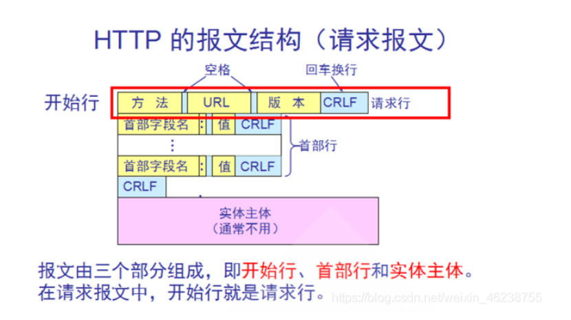

## 三次握手

TCP的三次握手是为了在两台计算机之间建立一条全双工的通道的连接，会占用两个计算机之间的通信线路。直到背一方或者双方关闭为止。TCP报头里面的拓展字段有 6 bit 的FLAG位。其中跟握手相关的有`SYN`(Synchronized Sequence Number)用作建立连接的同步信号,`ACK`(Ackonwledgement),用来对收到的数据进行确认`FIN`表示后面没有数据，表示结束。

最开始的的时候客户端和服务器都是`LISTENING`。

- **第一次握手**建立连接的时候，客户端发动一个数据包将SYN位置为1，表示希望建立连接，并且初始化一个序列号`seq`发送给server，此时客户端的状态进入`SYN_WAIT`
- **第二次握手**就是Server收到客户端的请求,通过STN=1知道这是要建立连接，于是发送一个响应包并将`SYN`位`ACK`位置为1，并且自己`ack（确认序列号）`必须是客户端发过来的`seq＋1`，表示收到了客户端的SYN，此时Server进入`SYN_REVD`状态。
- **第三次握手**，客户端收到服务器的响应包，检查ACK确认序列号是否是发送的`seq+1`，需要对响应包进行确认，确认包将ACK位置为1，确认序列号等于对方发来的序列号`seq+1`，自己的序列号`seq+1`，发送给服务器。此时进入`ESTABLISHED`状态。服务器此时检查收到的ACK和确认序列号,也进入`ESTABLISHED`状态，完成三次握手，连接建立。

```json
Client(send_wait)>>>>>>>>>>[SYN=1,Seq=x]>>>>>>>>>>>>>>>>>>>>Server

Client<<<<<<<<<<<<<<<<<[SYN=1,ACK=1,Seq=y,ack=x+1]<<<<<<<<<<Server(syn_revd)

Client(established)>>>>>[ACK=1,Seq=x+1,ack=y+1]>>>>>>>>>>>>>>Server
```

> 总结：syn是请求同步位，ack确认同步位，seq自己的序列号，，ackNum 确认对方发来的seq。

**可以两次握手吗？**

不可以。

三次连接第一是防止因为出现网络超时出现脏连接。

TTL网络报文的生存时间超过TCP请求的超时时间，假设两次握手可以建立建立。假设客户端发送一个超时的连接暂时没有到达服务器，此时在发送一个正常的连接和服务器通信后断开。断开连接后假设超时的连接到了服务器，此时服务器以为是新来建立连接的，确认建立连接。然后此时客户端不是SYN_SEND的状态，不会理会服务器的确认数据，这导致知识服务器单方面的建立了连接，浪费了资源。如果是三次握手的话，服务器会因为长时间没有收到客户端的这一次回复而导致连接建立失败。

其次就是在第一次握手服务器仅仅是知道了客户端可以发送数据的能力，如果自己发送出去的信息没有得到回复，服务器此时无法证明自己的发送能力和客户端的接受能力是正常的。还有就是双方的初始序列号也没有得到交换。

**可以四次握手吗？**

三次都可以，四次当然可以了。就是降低了传输的效率。本来现在TCP被人诟病的就是性能不好。

四次握手意思就是第二次握手的时候服务器只发送ACK和ACKNum,再发送一次自己的SYN和自己初始化SEQ序列号，显然这是可以合并为一次的。

**如果已经建立了连接，客户端故障了怎么办？**

服务端每次收到客户端的请求都会复位一个计时器，时间通常是2小时，若两个小时还没有收到客户端的消息，就会发送一个探测报文段，每隔75秒发一次，若一连10个报文段都没有响应，就认定客户端出现了故障，连接关闭。

现在也有将这种机制放在了应用层，定期发送心跳包来检测，一旦不对就回收连接。

**初始序列号是什么**

双方各自随机选择一个32位的数字作为发送数据的初始序列号，以后每次发动数据都是以这个数字为起点对发送的数据进行编号，以便于对方可以知道确认什么样的数据是合法的。

## 四次挥手

四次回收用来断开双方的连接.

- **第一次挥手**：Client将FIN置为1，发送一个Seq给Server，进入FIN_WAIT_1状态。
- **第二次挥手**：Server收到FIN后，发送一个ACK，ackNum = Seq + 1,进入CLOSE_WAIT状态。此时客户端没有要发送的数据了，但是可以接受服务器的消息.此时客户端处于FIN_WAIT_2。
- **第三次挥手**：此时服务器需要处理完数据，再发送一个FIN包，ACK=1,Ack = ack = seq+1.进入last_ack状态。
- **第四次挥手**：客户端收到服务的FIN后，进入TIME_WAIT状态，接着将ACK置为1，发送一个确认包给服务器，服务器收到后，进入closed状态，不再发送数据。客户端等待2*MSL（报文段最长寿命）时间，也进入closed状态。

```json
C(fin_wait_1)>>>>>>>>>>[FIN=1,Seq=x]>>>>>>>>S

C<<<<<<<[ACK=1,ack=x+1,seq=y1]<<<<<<<<<<<<<<<<S(close_wait)

c<<<<<<<[FIN=1,ACK=1,ack=x+1,seq=y2]<<<<<<<<<<<S(close)

c(close)>>>>>>>[ACK=1,Seq=x+1,ack=y2+1]>>>>>>>>>>>>>>>>S
```

**为什么不能把服务器的第二次挥手和第三次挥手的ACK和FIN合并起来，变为三次挥手?**

因为服务器收到客户端断开连接的请求，可能还有数据没有处理完毕，此时先确认，表示接收到了断开连接的请求，等处理完了之后再发送一个FIN包。

**TIME_WAIT的意义是什么？**

为了保证被动关闭放能够顺利进入closed状态。假设客户端的最后一次ACK没有成功的发送给了服务器，此时服务器会以为是客户端没有收到自己之前的消息，会再发送一次FIN_ACK,客户端收到第二次的三次挥手，会继续确认一次。并重新计时。

如果没有这个等待时间，服务器没有收到这个消息，四次挥手的ACK消息如果丢了，这回导致对方一直无法正常关闭。

## TCP如何实现流量控制？

在TCP的首部有一个窗口字段，占两个字节。窗口字段用来控制对方发送的数据量，单位是字节。TCP连接的一端根据设置的缓存空间大小确定自己的接受窗口大小，然后通知对方以确定对方发送窗口的上限。

发送窗口的上限不仅仅受接收方窗口大小限制，还有拥塞窗口。拥塞窗口就是网络传输的能力，取二者之间的最小值。

**什么是零窗口，接收窗口0会怎么样**

如果接收方没有能力接收数据，就会将接收窗口设置为0，这时发送方必须暂停发送数据，但是会启动一个持续计时器(persistence timer)，到期后发送一个大小为1字节的探测数据包，以查看接收窗口状态。如果接收方能够接收数据，就会在返回的报文中更新接收窗口大小，恢复数据传送。

****

## TCP的拥塞控制如何实现的？


拥塞控制主要由四个算法组成。

**慢启动，拥塞避免，快重传，快恢复**

- 慢启动：开始发送数据的时候，先把拥塞窗口cwnd设置为1，每次收到新的确认报文，窗口值翻倍。说是慢启动，其实cwnd的值增长的特别快，发送方的速度增快过快，从而发生网络拥塞的可能性更高，设置一个慢开始门限ssthresh,如果出现了超时，ssthresh = cwnd/2.然后重新开始慢开始。

- 拥塞避免：如果cwnd>=ssthresh，每次窗口值只加1.
- 快重传：快重传算法规定，发送方只要一连收到三个重复确认就应当立即重传对方尚未收到的报文段，而不必继续等待设置的重传计时器时间到期。
- 快恢复：当发送方连续收到三个重复确认时，就把慢开始门限减半，然后执行拥塞避免算法。不执行慢开始算法的原因：因为如果网络出现拥塞的话就不会收到好几个重复的确认，所以发送方认为现在网络可能没有出现拥塞。

## TCP与UDP的区别

- TCP是面向连接的，UDP是无连接的；

- TCP是可靠的，UDP是不可靠的；

- TCP只支持点对点通信，UDP支持一对一、一对多、多对一、多对多的通信模式；

- TCP是面向字节流的，UDP是面向报文的；

- TCP有拥塞控制机制;UDP没有拥塞控制，适合媒体通信；

- TCP首部开销(20个字节)比UDP的首部开销(8个字节)要大；

**无连接和有连接的区别**

无连接属于数据报服务，每个数据包含有目标地址，网络尽最大的努力交付数据，不保证不丢失，不保证先后顺序，不保证在时限内交付。

## HTTP和HTTPS的区别

首先端口号不同。HTTP是80端口，HTTP是443端口。

HTTP是明文传输，HTTPS运行于SSL层之上，添加了加密和认证机制，更加安全。加密解密带来了CPU的开销。HTTPS需要证书。

**HTTPS的连接过程**

- 客户端向服务端发送请求，发送自己支持的加密算法，和hash算法。
- 服务器根据客户端发来的加密算法选择一套适合双方的，将自己身份信息以证书的形式发送给客户端，证书里面包括了服务器自己的非对称加密的公钥，证书的颁发机构等信息。
- 客户端验证服务器的合法性，验证证书是否过期，CA机构是否可靠，收到的公钥是否能够正确解开发行者的 数字签名，服务器的域名和证书上的域名是否一致。
- 如果证书受信任或者不受信任，客户端随机一个随机数作为客户端的非对称加密的公钥，利用服务器的对称密钥对随机数加密，利用hash算法对摘要进行hash计算，并对摘要进行对称加密。加密后的随机密钥和摘要还有摘要的hash值一并发送给服务器。
- 服务器利用私钥解密出随机数密钥，得到对称加密的密钥，利用加密的密钥解密出摘要的hash，如果hash值是一致的（因为自己也是用的同一套hash算法,),以后都使用这个对称加密的密钥进行加密。

总结：非对称加密用于在握手过程中加密生成的密码，对称加密用于加密真正传输的数据进行加密。hash算法用于验证数据的完整性。

**对称/非对称加密的优缺点**

对称加密的优点就是计算速度快，但是因为知道了公钥就一定能够揭秘出数据，所以在传递公钥的时候如果被窃听，那么之后的数据都是不安全的。

非对称加密公钥加密的只能私钥解开，私钥加密的只能公钥解开。就算传输公钥被窃听，别人也破解不了数据。缺点就是运算速度慢。

所以HTTPS采用非对称加密算法加密对称密钥，再使用对称加密 加密传输的内容。

**网站时如何从http自动跳转到HTTPS的**

浏览器默认填充HTTP，网站采用301或者302跳转到HTTPS，这个过程使用了HTTP，还是会受到劫持。

可以使用HSTS优化。使用户浏览器在访问站点的时候强制使用HTTPS。

## Session和Cookie的区别

因为HTTP数无状态的，因此我们每次访问有登录需求的时候，都要不厌其烦的输入账号密码，然而实际上却没有出现这样的情况，这是因为引入了Cookie 和Session使HTTP具备了状态。


**Cookie**：是服务器发给客户端的特殊信息，以文本的形式存在客户端，客户端每次向服务器发送请求的时候，都会带上这些信息。也就是说当用户使用浏览器访问支持Cookie的网站的时候，用户会提供个人信息，并且提交至服务器，紧接着服务器宰相客户端回传超文本的同时也会发回这些个人信息，这些信息并不是存在HTTP Response Body，而是在HTTP Response Head。当浏览器接收到这样的信息的时候，浏览器会将这些信息存放在统一的位置，之后，再向服务端发送需要个人信息的时候，会将这些信息携带至请求头中，服务器接收到再收到带有Cookie的信息，会解析Cookie然后做其他操作作出响应。

**Session**:是服务器端的机制，服务器使用一种类似散列表的结构来保存信息，当程序需要为某个客户端请求创建一个Session的时候，服务器首先检查这个客户端的请求里是否已经包含了一个Session标识,也就是Session ID,如果包含了Session ID,则说明以前已经为这个客户端创建了Session,服务器就按照Session 吧Session检索出来使用，如果检索没有，就新建一个。如果请求没有Session ID,则为此客户端创建一个Session,并生成一个于此相关的Session ID,这是一个不会重复也没有 规律的字符串， 这个Session ID会在响应中回发给客户端并保存。

**Session的实现方式**：

使用Cookie实现，服务器回发一个JSESSIONID给客户端，客户端时候到保存下来请求的时候在带上。

使用URL回写实现：URL是指服务器在发送给浏览器页面的所有链接中， 都携带JSESSIONID 的参数，这样客户端后面的连接都携带上这个。

**区别**

一个在客户端，一个在服务端。

Cookie不安全，别人可以分析存在本地的Cookie.

如果考虑减轻服务器负担，应当使用Cookie


## 从输入 URL 到展现页面的全过程

浏览器查询 DNS，获取域名对应的IP地址:具体过程包括浏览器搜索自身的DNS缓存、搜索操作系统的DNS缓存、读取本地的Host文件和向本地DNS服务器进行查询等。对于向本地DNS服务器进行查询，如果要查询的域名包含在本地配置区域资源中，则返回解析结果给客户机，完成域名解析(此解析具有权威性)；如果要查询的域名不由本地DNS服务器区域解析，但该服务器已缓存了此网址映射关系，则调用这个IP地址映射，完成域名解析（此解析不具有权威性）。如果本地域名服务器并未缓存该网址映射关系，那么将根据其设置发起递归查询或者迭代查询；

浏览器获得域名对应的IP地址以后，浏览器向服务器请求建立链接，发起三次握手；

TCP/IP链接建立起来后，浏览器向服务器发送HTTP请求；

服务器接收到这个请求，并根据路径参数映射到特定的请求处理器进行处理，并将处理结果及相应的视图返回给浏览器；

浏览器解析并渲染视图，若遇到对js文件、css文件及图片等静态资源的引用，则重复上述步骤并向服务器请求这些资源；

浏览器根据其请求到的资源、数据渲染页面，最终向用户呈现一个完整的页面。

## HTTP请求有哪些常见的状态码

2xx状态码：操作成功。200 OK

3xx状态码：重定向。301 永久重定向；302暂时重定向

4xx状态码：客户端错误。400 Bad Request；401 Unauthorized；403 Forbidden；404 Not Found；

5xx状态码：服务端错误。500服务器内部错误；501服务不可用

**小记**

在短网址系统里面

永久重定向 301 和临时重定向 302。

如果使用 301 的话，搜索引擎会直接展示原始网址，那么 TinyURL 就无法收集用户的 User Agent 等信息。这些信息可以用来做一些大数据分析，从而为 TinyURL 带来收益，所以需要使用 302 重定向。

## TCP 怎么保证可靠传输？

- **检验和**

TCP校验和是一个端到端的校验和，由发送端计算，然后由接收端验证。其目的是为了发现TCP首部和数据在发送端到接收端之间发生的任何改动。如果接收方检测到校验和有差错，则TCP段会被直接丢弃。

把伪首部、TCP报头、TCP数据分为16位的字，如果总长度为奇数个字节，则在最后增添一个位都为0的字节。       把TCP报头中的校验和字段置为0。

其次，用反码相加法累加所有的16位字。最后，对计算结果取反，作为TCP的校验和。

- **序列号/确认应答机制**

只要发送端有一个包传输，接收端没有回应确认包（ACK包），都会重发。或者接收端的应答包，发送端没有收到也会重发数据。这就可以保证数据的完整性。

- **超时重传**

超时重传是指发送出去的数据包到接收到确认包之间的时间，如果超过了这个时间会被认为是丢包了，需要重传。**那么我们该如何确认这个时间值呢？**

一来一回的时间加上网络抖动的值。

- **最大消息长度**

在建立TCP连接的时候，双方约定一个最大的长度（MSS）作为发送的单位，重传的时候也是以这个单位来进行重传。理想的情况下是该长度的数据刚好不被网络层分块。

- **滑动窗口控制**

超时重传的机制存在效率低下的问题，发送一个包到发送下一个包要经过一段时间才可以。

窗口的大小就是在无需等待确认包的情况下，发送端还能发送的最大数据量。这个机制的实现就是使用了大量的缓冲区，通过对多个段进行确认应答的功能。通过下一次的确认包可以判断接收端是否已经接收到了数据，如果已经接收了就从缓冲区里面删除数据。

接收端在没有收到自己所期望的序列号数据之前，会对之前的数据进行重复确认。发送端在收到某个应答包之后，又连续3次收到同样的应答包，则数据已经丢失了，需要重发。

- **拥塞控制**

窗口控制解决了 两台主机之间因传送速率而可能引起的丢包问题，在一方面保证了TCP数据传送的可靠性。然而如果网络非常拥堵，此时再发送数据就会加重网络负担，那么发送的数据段很可能超过了最大生存时间也没有到达接收方，就会产生丢包问题。为此TCP引入慢启动机制，先发出少量数据，就像探路一样，先摸清当前的网络拥堵状态后，再决定按照多大的速度传送数据

## 简述 HTTP 1.0，1.1，2.0 的主要区别

## RestFul 是什么？RestFul 请求的 URL 有什么特点？

完全承认Http是用于标识资源。restFul URL是面向资源的，可以唯一标识和定位资源。 对于该URL标识的资源做何种操作是由Http方法决定的。 rest请求方法有4种，包括get,post,put,delete.分别对应获取资源，添加资源，更新资源及删除资源.

特点：

- 1.URL中不可出现动词
- 2.URL能够唯一地标识单个或一类资源
- 3.通过Http动词去操作URL标识的资源(get(获取),pst(添加),put(更新),delete(删除))

基于资源型的RESTFul API 接口粒度和返回结果过于的“粗”，它通常返回的都是完整的数据模型，这对于客户端非常不友好。但开放API之所以开放，就是因为它不知道你到底需要什么返回结果，既然不知道，那么我干脆都返回给你。这样的好处是通用，但客户端不好处理。你只需要一个字段，服务器啪的丢给你十几个，作为客户端开发者你怎么想？

内部开发由于需求非常明确，通常来说服务器是不应该简单粗暴的直接甩资源实体给客户端的。那RESTFul API就不能接入到内部开发吗？当然不是，我们需要灵活一些借鉴RESTFul中的优点，来设计我们的内部API。

## DNS 查询服务器的基本流程是什么？DNS 劫持是什么？

1. 首先浏览器会首先搜索浏览器自己的DNS缓存，有且没有过期的话就直接返回。

2. 如果浏览器自身缓存没有找到，那么再搜索操作系统自身的DNS缓存，有且没有过期直接返回。

3. 如果操作系统自身缓存没有找到，尝试读取本机的hosts文件，有就直接返回。

4. 如果hosts文件没有，浏览器发起一个DNS的系统调用,本地的DNS客户端程序往本机配置的首选的DNS服务器发起域名解析的请求。当DNS服务器不能自己解析时，会向其他的服务器请求。这里DNS服务器域名解析对于找不到的情况有递归和迭代的两种方式。

   ​	**递归**

    当DNS服务器自己不能解析的时候，会向其他服务器发起请求，此时不会直接返回。

     **迭代**

   迭代时自己不能解析的时候，将其他能解析的服务器地址发给客户端，让客户端再去请求。

**DNS劫持**

就是通过劫持了DNS服务器，通过某些手段取得某域名的解析记录控制权，进而修改此域名的解析结果，导致对该域名的访问由原IP地址转入到修改后的指定IP，其结果就是对特定的网址不能访问或访问的是假网址，从而实现窃取资料或者破坏原有正常服务的目的。DNS劫持通过篡改DNS服务器上的数据返回给用户一个错误的查询结果来实现的。

**HTTP劫持**

一种是检测到了你的HTTP请求，提前返回302让你跳转到其他的页面。

二是修改返回结果，在返回的结果里面加入嵌入广告页面。

## 什么是跨域，什么情况下会发生跨域请求？

跨域问题是引文浏览器的同源策略施加的安全限制。

它会阻止一个域的js脚本和另外一个域的内容进行交互，如果缺少了同源策略，浏览器很容易受到XSS、CSFR等攻击。所谓同源（即在同一个域）就是两个页面具有相同的**协议（protocol）、主机（host）和端口号（port）**。以上三个任意一个不同时便会发生跨域。

**CORS -- 跨站资源共享**

原理是使用自定义的HTTP头部让浏览器与服务器进行沟通，从而决定请求或响应是应该成功还是失败。请求和响应都不包含cookie信息。
CORS需要浏览器和后院同时支持，浏览器会自动进行CORS通信，实现CORS通信的关键是后端，只要后端实现了CORS，就实现了跨域，服务端设置Access-Control-Allow-Origin 就可以开启CORS，该属性表示哪些域名可以访问资源，如果设置通配符则表示所有网站都可以访问资源。

## HTTP 中 GET 和 POST 区别

二者在HTTP上规定的语义是不同的。

GET请求的语义是指获取指定的资源。GET方法是安全的，幂等的，可缓存的，报文主体没有任何语义。

POST请求的语义是根据请求主体对指定的资源做出处理。POST方法不安全，不幂等，不可缓存。

在实际的实现上，并没有严格的遵循语义来实现。

**在使用上形式上**

一般情况下。GET的请求的数据一般附于URL之后，且有长度限制，长度限制不是协议限制的，是浏览器和服务器限制。POST请求的数据在请求体中。

且GET只支持ASCII编码,而post请求支持二进制编码。

## 什么是 TCP 粘包和拆包

TCP是面向字节流的传输层协议，TCP底层不了解业务数据的含义，它会根据TCP缓冲区的实际情况进行包的划分，所以业务上认为，一个完整的包可能被TCP拆分为多个包进行发送，也可能把多个小包封装成一个大的数据包进行发送，这就是所谓的TCP粘包和拆包问题。

**解决办法**

- 发送端给每个数据包添加包首部，首部中应该至少包含数据包的长度，这样接收端在接收到数据后，通过读取包首部的长度字段，便知道每一个数据包的实际长度了。
- 发送端将每个数据包封装为固定长度（不够的可以通过补0填充），这样接收端每次从接收缓冲区中读取固定长度的数据就自然而然的把每个数据包拆分开来。
-  可以在数据包之间设置边界，如添加特殊符号，这样，接收端通过这个边界就可以将不同的数据包拆分开。

## TCP 挥手时出现大量 CLOSE_WAIT 或 TIME_WAIT 怎么解决？

**CLOSE_WAIT**

被动要求关闭放在手打对方的FIN报文并发出了ACK报文，进入CLOSE_WAIT状态，此时表示在等待关闭，并且通知应用程序等待发送剩余的数据，处理现场信息，关闭相关资源。

**解决**

close_wait状态太多很可能是程序代码出了问题，比如在对方关闭连接后，程序没有检测到，或者忘记关闭了自己的连接。

**TIME_WAIT**

主动要求关闭的机器收到了对方的FIN报文并发出了ACK回应。此时等待一段时间确认被关闭方能够正常关闭。

因为time_wait阶段没有真正释放句柄资源，占用的端口仍然不能使用。如果并发太高，此阶段的连接太多，限制有效连接的创建。

**解决**

修改/etc/sysctl.conf

允许复用time_wait阶段的socket连接

将time_wait阶段的时间改小，因为如果不是对方的连接的异常，一般不出现连接无法关闭的情况。

## TCP 的 keepalive 了解吗？说一说它和 HTTP 的 keepalive 的区别？

>**TCP的keepalive机制是心跳检测机制，是为了关闭无用的连接。**
>
>**HTTP的keepalive机制是连接复用，避免频繁销毁和创建TCP的性能消耗。**

- **TCP 的 keepalive**

   连接建立之后，如果客户端一直不发送数据，或者隔很长时间才发送一次数据，当连接很久没有数据报文传输时如何去确定对方还在线，到底是掉线了还是确实没有数据传输，连接还需不需要保持，这种情况在TCP协议设计中是需要考虑到的。 TCP协议通过一种巧妙的方式去解决这个问题，当超过一段时间之后，TCP自动发送一个数据为空的报文（侦测包）给对方，如果对方回应了这个报文，说明对方还在线，连接可以继续保持，如果对方没有报文返回，并且重试了多次之后则认为链接丢失，没有必要保持连接。

  不少服务将这种心跳机制放在了应用层。

- **HTTP 的 keepalive**

  因为HTTP是无状态的，基于请求响应模式的。客户端的每一次请求都要和服务端创建TCP连接，服务器响应后，断开TCP连接。下次客户端再有请求，则重新建立连接。

   开启keep_alive后， 在一次http请求中，服务器进行响应后，不再直接断开TCP连接，而是将TCP连接维持一段时间。在这段时间内， 如果同一客户端再次向服务端发起http请求，便可以复用此TCP连接，向服务端发起请求，并重置timeout时间计 数器，在接下来一段时间内还可以继续复用。这样无疑省略了反复创建和销毁TCP连接的损耗。

## 从系统层面上，UDP如何保证尽量可靠？


## 简述 DDOS 攻击原理，如何防范它？

DDos的前身 DoS (DenialofService)攻击，其含义是拒绝服务攻击，这种攻击行为使网站服务器充斥大量的要求回复的信息，消耗网络带宽或系统资源，导致网络或系统不胜负荷而停止提供正常的网络服务。而DDoS分布式拒绝服务，则主要利用 Internet上现有机器及系统的漏洞，攻占大量联网主机，使其成为攻击者的代理。当被控制的机器达到一定数量后，攻击者通过发送指令操纵这些攻击机同时向目标主机或网络发起DoS攻击，大量消耗其网络带和系统资源，导致该网络或系统瘫痪或停止提供正常的网络服务。由于DDos的分布式特征，它具有了比Dos远为强大的攻击力和破坏性。

**常见的攻击方式  SYN flood、UDP flood**

- synflood

  使用SYN-Flood进行攻击,SYN-Flood也就是SYN洪水攻击。SYN-Flood不会完成TCP三次握手的第三步,也就是不发送确认连接的信息给服务器。这样,服务器无法完成第三次握手,但服务器不会立即放弃,服务器会不停的重试并等待一定的时间后放弃这个未完成的连接,这段时间叫做SYN timeout,这段时间大约30秒-2分钟左右。若是一个用户在连接时出现问题导致服务器的一个线程等待1分钟并不是什么大不了的问题,但是若有人用特殊的软件大量模拟这种情况,那后果就可想而知了。一个服务器若是处理这些大量的半连接信息而消耗大量的系统资源和网络带宽,这样服务器就不会再有空余去处理普通用户的正常请求(因为客户的正常请求比率很小)。这样这个服务器就无法工作了,这种攻击就叫做:SYN-Flood攻击。

- UDPFood

  利用大量UDP小包冲击DNS服务器或Radius认证服务器、流媒体视频服务器。 100k pps的UDP Flood经常将线路上的骨干设备例如防火墙打瘫，造成整个网段的瘫痪。由于UDP协议是一种无连接的服务，在UDP FLOOD攻击中，攻击者可发送大量伪造源IP地址的小UDP包。但是，由于UDP协议是无连接性的，所以只要开了一个UDP的端口提供相关服务的话，那么就可针对相关的服务进行攻击。

  ## 简述 JWT 的原理和校验机制

  > JWT是基于json的一个公开规范，允许我们使用JWT在用户和服务器之间传递安全可靠的信息，主要用于认证和数据交换。

使用方式是在用户登陆后服务器根据规范生成一个token，发给客户端，此后看客户端的每次请求都可以携带这个令牌表明自己的身份信息。类似于Session,但是却不保存在服务端。

JWT主要由三个部分组成。

头部，载荷，签名

头部用于描述JWT的基本信息，比如签名使用的算法。

载荷用于保存实际需要传递的数据，和一些我们自定义的私有字段。

签名部分是利用算法对头部和载荷做一次计算得出来的结果。如果有人对头部和载荷部分进行更改的话，，那么的出来的签名一定是不一样的，所以签名可以判断内容是否被更改。

## HTTP 的方法有哪些？

常用的由GET,HEAD,POST,DELETE,PUT,DELETE,OPTIONS

GET

> 获取资源

HEAD

> 和 GET 方法类似，但是不返回报文实体主体部分。主要用于确认 URL 的有效性以及资源更新的日期时间等。

POST

>POST 主要用来传输数据，而 GET 主要用来获取资源。

PUT

> 上传文件，由于自身不带验证机制，任何人都可以上传文件，因此存在安全性问题，一般不使用该方法。

DELETE

> 删除资源

OPTIONS

>查询指定的 URL 能够支持的方法。会返回 `Allow: GET, POST, HEAD, OPTIONS` 这样的内容。

## TCP长连接和短连接有那么不同的使用场景？

**长连接**

指在一个TCP连接上可以连续发送多个数据包，在TCP连接保持期间，如果没有数据包发送，需要双方发检测包以维持此连接，一般需要自己做在线维持

**短连接**

指通信双方有数据交互时，就建立一个TCP连接，数据发送完成后，则断开此TCP连接（管理起来比较简单，存在的连接都是有用的连接，不需要额外的控制手段）

**场景区别**

长连接多用于操作频繁（读写），点对点的通讯，而且连接数不能太多情况。每个TCP连接都需要三步握手，这需要时间，如果每个操作都是先连接，再操作的话那么处理速度会降低很多，所以每个操作完后都不断开，次处理时直接发送数据包就OK了，不用建立TCP连接。例如：数据库的连接用长连接。

短连接适用于网页浏览等数据刷新频度较低的场景。一般而言像及京东，淘宝这些大型网站，随时都会有成千上万的用户请求，一般使用短连接，用户量太大，服务器扛不住那么多长连接；

## 什么是 ARP 协议？简述其使用场景

>**ARP协议完成了IP地址与物理地址的映射**

- 每一个主机都有都有一个ARP缓存，里面有所在局域网各个主机和路由器IP地址到硬件地址的映射表。
- 当源主机要发送一个数据包到目的主机时，会首先检查自己的ARP有没有目的主机的MAC地址，如果有就直接发送。
- 如果没有，就向所在局域网发送一个ARP请求的广播，发送此请求时，也会带上自己的IP地址和自己的MAC地址。收到请求的主机会检查自己的IP地址是否和目的IP地址一致，如果是就先保存源主机的IP地址和MAC地址到ARP缓存，然后给响应源主机。源主机收到响应，也会先添加目的主机IP地址和MAC地址的映射，再进行数据的发送。
- 如果所要找的主机和源主机不在同一个局域网上，那么就要通过 ARP 找到一个位于本局域网上的某个路由器的硬件地址，然后把分组发送给这个路由器，让这个路由器把分组转发给下一个网络。剩下的工作就由下一个网络来做。

## 简述 RPC 的调用过程（待定）

https://www.cnblogs.com/FG123/p/10261676.html

## TCP 中 SYN 攻击是什么？如何防止？

>SYN攻击利用TCP协议缺陷，通过发送大量的半连接请求，耗费CPU和内存资源。

在TCP三次握手里面，在客户端发出一个请求建立连接的SYN请求后，服务端要回复一个SYN+ACK应答报文，如果此时客户端掉线或者死机或者故意不回应，服务端会发起重试，再次发起SYN+ACK的应答报文并等待一段时间才丢弃这个连接。

但如果有一个恶意的攻击者大量模拟这种情况，服务器端将为了维护一个非常大的半连接列表而消耗非常多的资源----数以万计的半连接，即使是简单的保存并遍历也会消耗非常多的CPU时间和内存，何况还要不断对这个列表中的IP进行SYN+ACK的重试。

实际上如果服务器的TCP/IP栈不够强大，最后的结果往往是堆栈溢出崩溃---即使服务器端的系统足够强大，服务器端也将忙于处理攻击者伪造的TCP连接请求而无暇理睬客户的正常请求。

**防止**

- 释放无效连接

  这种方法不停监视系统的半开连接和不活动连接，当达到一定阈值时拆除这些连接，从而释放系统资源。这种方法对于所有的连接一视同仁，而且由于SYN Flood造成的半开连接数量很大，正常连接请求也被淹没在其中被这种方式误释放掉。

- 延缓TCB分配方法

  当开放了一个TCP端口后，该端口就处于Listening状态，不停地监视发到该端口的SYN报文，一旦接收到Client发来的SYN报文，就需要为该请求分配一个TCB（Transmission Control Block），通常一个TCB至少需要280个字节。

  如果恶意的向某个服务器端口发送大量的SYN包，则可以使服务器打开大量的半开连接，分配TCB，从而消耗大量的服务器资源，同时也使得正常的连接请求无法被相应。

  当正常连接建立起来后再分配TCB则可以有效地减轻服务器资源的消耗。常见的方法是使用SYN Cache和SYN Cookie技术。

  **synCache**

  在收到SYN数据报文时不急于去分配TCB，而是先回应一个SYN ACK报文，并在一个专用HASH表（Cache）中保存这种半开连接信息，直到收到正确的回应ACK报文再分配TCB

  **synCookie**

  使用一种特殊的算法生成Sequence Number，这种算法考虑到了对方的IP、端口、己方IP、端口的固定信息，以及对方无法知道而己方比较固定的一些信息，如MSS、时间等，在收到对方的ACK报文后，重新计算一遍，看其是否与对方回应报文中的（SequenceNumber-1）相同，从而决定是否分配TCB资源。

## 简述 TCP 的报文头部结构


**源端口 16**

>指定了发送端的端口

**目的端口 16**

>指定了接受端的端口号

**序号 32**

> 指明了段在即将传输的段序列中的位置 seq = x

**确认号 32**

>规定成功收到段的序列号，确认序号包含发送确认的一端所期望收到的下一个序号 ack = x + 1

**TCP偏移量  4**

> 指定了段头的长度。段头的长度取决与段头选项字段中设置的选项

**保留位 6**

> 指定了一个保留字段，以备将来使用

**标志 6**

>  SYN： 表示同步
>
>   ACK： 表示确认
>
>    PSH： 表示尽快的将数据送往接收进程
>
>    RST： 表示复位连接
>
>    URG： 表示紧急指针
>
>    FIN： 表示发送方完成数据发送

**窗口 16**

> 指定关于发送端能传输的下一段的大小的指令

**校验和 16**

>校验和包含TCP段头和数据部分，用来校验段头和数据部分的可靠性

**紧急 16**

> 指明段中包含紧急信息，只有当U R G标志置1时紧急指针才有效

## 简述什么是 XSS 攻击以及 CSRF 攻击？

**XSS跨站脚本攻击**

恶意攻击者在web页面中会插入一些恶意的script代码。当用户浏览该页面的时候，那么嵌入到web页面中script代码会执行，因此会达到恶意攻击用户的目的。

**CSRF 跨站请求伪造**

攻击者盗用了你的身份，以你的名义发送恶意请求，对服务器来说这个请求是完全合法的，但是却完成了攻击者所期望的一个操作。

**防范CSRF攻击**

利用浏览器的同源策略，在HTTP接口执行前验证页面或者Cookie里设置的token。只要验证通过才能继续执行请求。

增强人机交互，重要操作要校验短信验证码等等。

## 如何设计 API 接口使其实现幂等性？

> 幂等的的意思就是一个操作不会修改状态信息，并且每次操作的时候都返回同样的结果。在web设计上即指多次HTTP请求返回值相同

在HTTP标准定义的方法中GET,PUT,DELETE是幂等的。实际中根据业务需求来考虑会有变化。

因为实际情况可能会因为网络波动，用户使用习惯，框架调用超时的自动重试机制都会发起多次接口调用，后端需要小心防范以上情况，确保操作生效了一次而不重复执行，确保幂等性。

- **数据库唯一主键实现幂等性**

数据库**唯一主键**的实现主要是利用数据库中主键唯一约束的特性，一般来说唯一主键比较适用于“插入”时的幂等性，其能保证一张表中只能存在一条带该唯一主键的记录

- **数据库乐观锁实现幂等性**

  数据库乐观锁方案一般只能适用于执行**更新操作**的过程，我们可以提前在对应的数据表中多添加一个字段，充当当前数据的版本标识。

  这样每次对该数据库该表的这条数据执行更新时，都会将该版本标识作为一个条件，值为上次待更新数据中的版本标识的值。

- **防重 Token 令牌如何实现幂等性**

  针对客户端连续点击或者调用方的超时重试等情况，例如提交订单，此种操作就可以用 `Token` 的机制实现防止重复提交。

  简单的说就是调用方在调用接口的时候先向后端请求一个全局 `ID（Token）`，请求的时候携带这个全局 `ID` 一起请求（`Token` 最好将其放到 `Headers` 中），后端需要对这个 `Token` 作为 `Key`，用户信息作为 `Value` 到 `Redis` 中进行键值内容校验，如果 `Key` 存在且 `Value` 匹配就执行删除命令，然后正常执行后面的业务逻辑。如果不存在对应的 `Key` 或 `Value` 不匹配就返回重复执行的错误信息，这样来保证幂等操作。

- **下游传递唯一序列号实现幂等性**

  每次向服务端请求时候附带一个短时间内唯一不重复的序列号，该序列号可以是一个**有序 `ID`**，也可以是一个**订单号**，一般由下游生成，在调用上游服务端接口时附加该序列号和用于认证的 `ID`。

  当上游服务器收到请求信息后拿取该 **序列号** 和下游 **认证ID** 进行组合，形成用于操作 Redis 的 `Key`，然后到 Redis 中查询是否存在对应的 `Key` 的键值对，根据其结果：

1. **如果存在**，就说明已经对该下游的该序列号的请求进行了业务处理，这时可以直接响应重复请求的错误信息。
2. **如果不存在**，就以该 `Key` 作为 Redis 的键，以下游关键信息作为存储的值（例如下游商传递的一些业务逻辑信息），将该键值对存储到 Redis 中 ，然后再正常执行对应的业务逻辑即可

## HTTP 是无状态的吗？需要保持状态的场景应该怎么做？

**无状态的定义**

协议对于事务处理没有记忆能力，服务器不知道客户端是什么状态。也就是说，打开一个服务器上的网页和上一次打开这个服务器上的网页之间没有任何联系。 HTTP是一个无状态的面向连接的协议，无状态不代表HTTP不能保持TCP连接，更不能代表HTTP使用的是UDP协议(无连接)。

 缺少状态意味着如果后续处理需要前面的信息，则它必须重传，这样可能导致每次连接传送的数据量增大。另一方面，在服务器不需要先前信息时它的应答就较快。

使用cookie，session，token。


## 简述 TCP 协议的延迟 ACK 和累计应答

> 延迟ACK是为了将多个ACK合并，达到减少网络流量，提高传输效率的目的。
>
> 累计应答避免了一系列应答中的某个应答丢失造成的无必要的重传。

- 延迟ACK

  接收方在收到数据的时候，并不是立即回复ACK而是延迟一段时间，系统有一个固定的时间来检查需要发送ACK包。这样做的是假设此期间连续收到了两个TCP包，就不需要ACK两次，只需要回复最终的ACK就可以了。可以降低网络流量。

  如果接收方正好也有数据要发送，那么就在此次发送数据的TCP数据包里面顺带带上ACK信息。

- 累计应答

  对于发送方来说，只要在发送方超时时间内接收到了接收方应该返回的一串应答中的一个，就视为确认了前面的全部数据。累计应答机制也是为了更快的传输，减少了回复ACK的次数。

## SSL握手流程为什么要使用对称秘钥？

这是考虑到了效率。

通过对称加密的方式对内容进行加密，加密解密速度快，很适合HTTP的应用场景。

但是对称加密的方式交换的密钥如果被第三方得知，便没有了安全性。所以HTTPS交换密钥的阶段采用了非对称加密。非对称加密的方式适合加密少量数据，因此兼顾效率和安全。HTTPS采用对称加密 加密传输内容，使用非对称加密加密对称密钥。

## 简述 WebSocket 是如何进行传输的

- 不同于HTTP的请求-响应模式，websocket是一种双向通信协议。在建立连接后，WebSocket服务器端和客户端都能主动向对方发送或接收数据。
- WebSocket需要像TCP一样，先建立连接，连接成功后才能相互通信。

一旦WebSocket连接建立后，后续数据都以帧序列的形式传输。在客户端断开WebSocket连接或Server端中断连接前，不需要客户端和服务端重新发起连接请求。在海量并发及客户端与服务器交互负载流量大的情况下，极大的节省了网络带宽资源的消耗，有明显的性能优势，且客户端发送和接受消息是在同一个持久连接上发起，实时性优势明显。

传统的HTTP长连接是伪长连接，每次请求仍然需要发送header等信息。Websocket协议通过第一个request建立了TCP连接之后，之后交换的数据都不需要发送 HTTP header就能交换数据。


而实现起来并不是建立了连接后就可以一直保持了，很多中间节点可能会因为连接在一段时间内没有数据发送认位连接失效了，切开连接，websocket为了解决这个问题会通过一种frame数据包来维持连接。

## 如何解决 TCP 传输丢包问题？

首先TCP协议层面做了很多措施来保证数据不丢包。

- 发送端对数据进行分片，接收端对数据进行重组和重排序切会丢弃重复的数据。还会根据首部的校验和来判断数据是否发生循坏，丢弃有差错的数据。
- 接收到数据后会有回复确认。
- 对于没有及时确认的数据有重发机制。
- 使用滑动窗口进行流量控制，协调发送方的速度。

如果发生了丢包。可能是沾包和拆包的问题导致数据不完整。

- 1.消息定长，例如每个报文的大小为固定长度200字节,如果不够，空位补空格；
- 2.在包尾增加回车换行符进行分割，例如FTP协议；
- 3.将消息分为消息头和消息体，消息头中包含表示消息总长度（或者消息体长度）的字段，通常设计思路是消息头的第一个字段用int来表示消息的总长度；

## 简述 HTTP 的 keepalive 的原理和使用场景

HTTP的keepalive功能是自HTTP1.1后默认开启的功能。

在一次http请求中，服务器进行响应后，不再直接断开TCP连接，而是将TCP连接维持一段时间。在这段时间内，如果同一客户端再次向服务端发起http请求，便可以复用此TCP连接，向服务端发起请求，并重置timeout时间计数器，在接下来一段时间内还可以继续复用。这样无疑省略了反复创建和销毁TCP连接的损耗。

## 简述在四层和七层网络协议中负载均衡的原理

>应用层，会话层，表示层，传输层，网络层，数据链路层，物理层。

七层网络协议是OSI网络协议 。四层是传输层。第七层是应用层。

- **负载均衡的简单概念**

  一是将大量的并发处理转发给后端多个节点处理，减少工作响应时间；

  二是将单个繁重的工作转发给后端多个节点处理，处理完再返回给负载均衡中心，再返回给用户。目前负载均衡技术大多数是用于提高诸如在Web服务器、FTP服务器和其它关键任务服务器上的Internet服务器程序的可用性和可伸缩性。

- **四层负载均衡**

  主要通过报文中的目标地址和端口，再加上负载均衡设备设置的服务器选择方式，决定最终选择的内部服务器。 
  以常见的TCP为例，负载均衡设备在接收到第一个来自客户端的SYN 请求时，即通过上述方式选择一个最佳的服务器，并对报文中目标IP地址进行修改(改为后端服务器IP），直接转发给该服务器。后续这个连接的所有流量都同样转发到同一台服务器处理**。四层负载均衡里面，服务器和客户端的是直接连接的。**在某些部署情况下，为保证服务器回包可以正确返回给负载均衡设备，在转发报文的同时可能还会对报文原来的源地址进行修改。

- **七层负载均衡**

  主要经过报文中的真正有意义的应用层内容，再加上负载均衡设备设置的服务器选择方式，决定最终选择的内部服务器。

  负载均衡设备如果要根据真正的应用层内容再选择服务器，只能先代理最终的服务器和客户端建立连接(三次握手)后，才可能接受到客户端发送的真正应用层内容的报文，然后再根据该报文中的特定字段，再加上负载均衡设备设置的服务器选择方式，决定最终选择的内部服务器。负载均衡设备在这种情况下，更类似于一个代理服务器。负载均衡和前端的客户端以及后端的服务器会分别建立TCP连接。

- **比较**

  七层负载均衡可以更加的智能化，比如在四层负载均衡中，一个连接被转发到一个服务器吗，这个服务器将一直处理这个TCP连接。AB两个TCP连接被分配到了不同的服务器，但是他们请求频率不一致，或者任务量不一致。这就很难确保均衡的概念。七层在应用层，可以根据请求的目的和内容分发到不同的服务器。比如读写分离。

  **-** **七层负载均衡**基本都是**基于http协议的**，适用于web服务器的负载均衡。
  **-** **四层负载均衡**主要是**基于tcp协议报文**，可以做任何基于tcp/ip协议的软件的负载均衡。

## 简述 TCP 半连接发生场景

TCP三次握手节点第二次握手时，服务器接收到了客户端的请求建立同步的SYN请求，回复一个SYN+ACK的数据包，此时服务器处于SYN_RECV阶段，会等待一段时间等待客户端的 ACK数据包。此时属于半连接状态。

## 简述 HTTP 报文头部的组成结构

**HTTP报文请求报文**



```json
请求行:请求方法，URL,协议版本 \r\n
请求头: header*           \r\n
 \r\n
请求体：
```

**HTTP响应报文**


```json
状态行:服务器HTTP协议版本，响应状态码，状态码的文本描述/r/n
响应头: /r/n
/r/n
响应体
```

## 什么是中间人攻击？如何防止攻击？

中间人攻击指攻击者与通讯的两端分别创建独立的联系，并交换其所收到的数据，使通讯的两端认为他们正在通过一个私密的连接与对方 直接对话，但事实上整个会话都被攻击者完全控制。在中间人攻 击中，攻击者可以拦截通讯双方的通话并插入新的内容。

- **攻击方式**

攻击者在网关截获SSL会话，替换服务器公钥证书，将公钥`PKey`换成自己的公钥`PKey`，欺骗客户端。客户端使用`PKey`加密信息并发送会话，中间人用私钥`Skey`解密客户端返回会话，从而劫持会话。同时，中间人用`PKey`加密明文会话并返回服务器

这种攻击会存在一个问题会被感知到，就是`Attacker`的证书是伪造的不受信任的证书，所以客户端可以确认是否需要真的连接该服务器

- **防御**
  1.  使用HTTPS

中间攻击可以冒充服务器与客户端交换密钥，简单的非对称加密也不可行。

```json
-  服务器发送公钥给客户端，中间人拦截公钥，返回一个自己造的假的公钥给客户端。
-  客户端收到假公钥，生成加密hash给服务器被中间人拦截。中间人解密出hash指，用真公钥计算hash值发送给服务器。所以需要一个第三方来维护过程的安全性。CA机构的证书。CA证书包含了服务器的信息和公钥密码，对CA证书进行完整性校对可避免中间人攻击。
```

​		2.  使用耗时长的加密算法

使用耗时长的加密算法，可以预估出时间。这样如果有中间人，那么网络来回时间一定对不上.

## TCP 如何实现数据有序性？

> TCP通过数据编号和应答机制实现了有序性。

- TCP将每个数据片段的头部分配了序列号，就是为了接收方对数据进行有序重组。

- 当某个片段按照顺序发送后，发送方会将已发送的数据片段暂时保存在 **缓冲区** 内，并为每个已发送的数据设置一个 **时间区间** 。
- 当接收方收到正确的符合顺序的数据片段后，会优先对数据片段做完整检验，如确认无误，再把数据片段交给上层协议。并恢复ACK和确认序列号。
- 发送方通过确认序列号知道哪些数据是被正确的送达了的。
- 如果在规定时间内，接收方没有说到可以组成有序的数据包，那么他不会应答。发送方没有收到ACK确认就会一直重试发送数据，直到达到重试上限为止。

## 简述 HTTP 短链接与长链接的区别

HTTP的长连接和短连接本质上是TCP长连接和短连接。

如果是使用短链接模式，HTTP每次请求响应一次后，就会关闭这次的TCP连接。下次请求，需要重新建立TCP连接。

如果是长连接模式，HTTP通过设置请求头connection:keepAlive.HTTP1.1默认开启。

在使用长连接的情况下，当一个网页打开完成后，客户端和服务器之间用于传输HTTP数据的TCP连接不会关闭，客户端再次访问这个服务器时，会继续使用这一条已经建立的连接。Keep-Alive不会永久保持连接，它有一个保持时间，可以在不同的服务器软件（如Apache）中设定这个时间。实现长连接需要客户端和服务端都支持长连接。

长连接暂时保持一端时间的TCP连接的状态，复用此次连接完成多次请求。