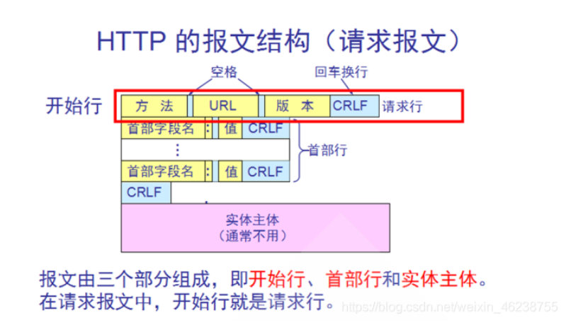
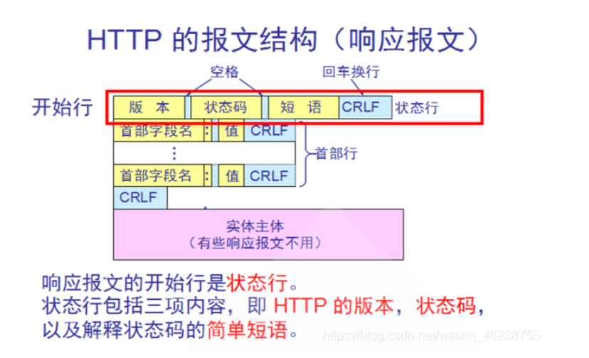

# HTTP

**HTTP请求报文**

**HTTP响应报文**

## HTTP的相关方法

## Keep-Alive 和非 Keep-Alive 区别，对服务器性能有影响吗

HTTP的keepalive功能是自HTTP1.1后默认开启的功能。

在一次http请求中，服务器进行响应后，不再直接断开TCP连接，而是将TCP连接维持一段时间。在这段时间内，如果同一客户端再次向服务端发起http请求，便可以复用此TCP连接，向服务端发起请求，并重置timeout时间计数器，在接下来一段时间内还可以继续复用。这样无疑省略了反复创建和销毁TCP连接的损耗。

如果时间设置的太长，长时间的保持 TCP 连接时容易导致系统资源被无效占用。