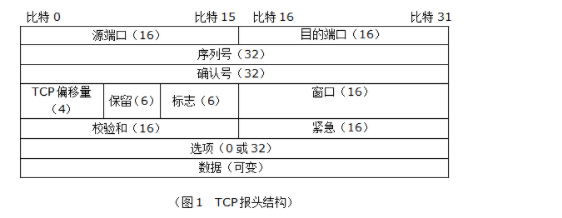
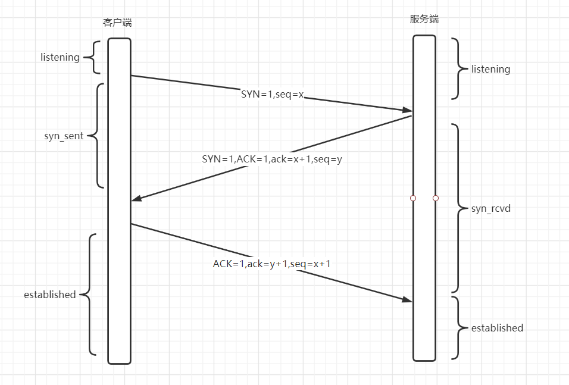
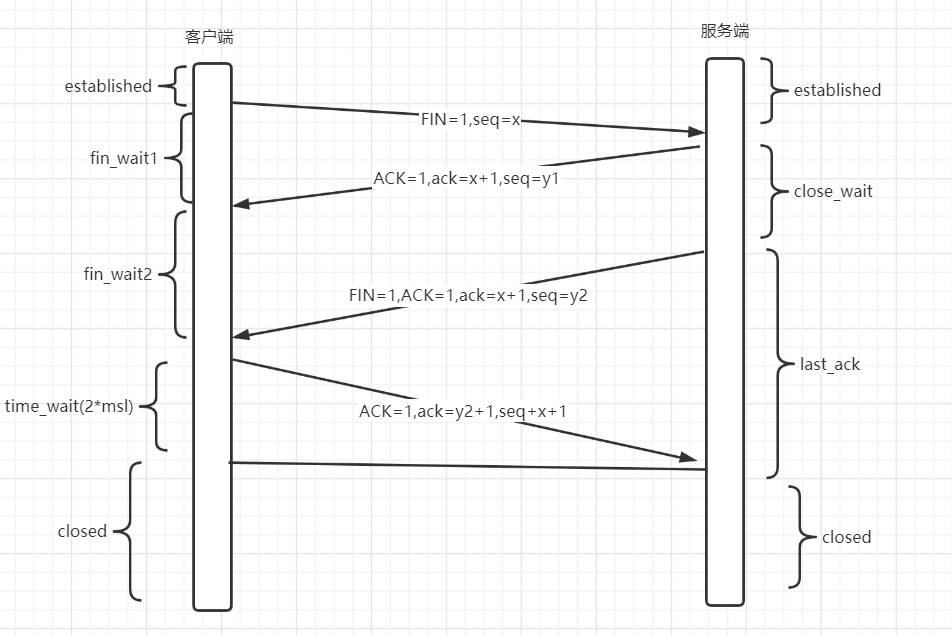
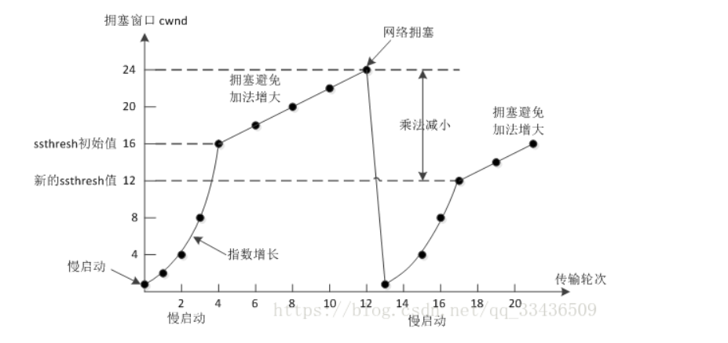

# TCP

## TCP报文首部结构

## TCP的三次握手

> TCP 连接的双方会通过三次握手确定 TCP 连接的初始序列号、窗口大小以及最大数据段，这样通信双方就能利用连接中的初始序列号保证双方数据段的不重不漏、通过窗口大小控制流量并使用最大数据段避免 IP 协议对数据包的分片

**简要过程**

1. 开始双方处于`LISTENING`的阶段,假设以客户端请求与服务端建立连接为例。
2. 第一次握手的时候，客户端初始化自己的序列号SEQ,将SYN位置为1，表示希望建立连接，发功给服务端，此时客户端处于`SYN_SENT`的状态。
3. 第二次握手是服务端收到了客户端发来的数据包，知道这是一次请求建立的连接，将自己的`SYN`位置为1，`ACK`为也置为1，确认序列号`ackNum`为客户端发来的序号+1，并初始化一个自己的序列号`SEQ`。此时服务端处于`SYN_RECV`的状态。
4. 第三次握手客户端收到了服务端的响应消息，检查回复的确认系列号是否是自己发送的序号+1,检查正确后将自己的ack位置为1，`ackNum`=服务器发来的序列号+1，发送给服务器，进入进入`ESTABLISHED`状态。服务器器检查这条消息的确认号和确认位后，也进入`ESTABLISHED`状态，完成三次握手，连接建立。

**为什么是三次握手？**

为什么是三次握手，两次或者更多次不行吗。

> TCP 连接使用三次握手的首要原因 —— 为了阻止历史的重复连接初始化造成的混乱问题，防止使用 TCP 协议通信的双方建立了错误的连接。

- 假设可以通过两次握手建立连接，那么发送方一旦发出建立连接的请求，他就没有办法撤回这一次请求。如果网络情况较差，发送方连续发送了多次建立连接的请求，因为此时此刻是两次握手，只能通信两次，那么接收方他不知道这到底是不是历史连接，他只能选择接受或者拒绝，所以在三次握手里面接收方收到了连接请求会将发送方发来的`seq+1`回复给发送方，由发送方来判断此次连是否是历史连接。如果是历史连接，发送方会发送RST控制消息中断连接，如果不是历史连接，发送方正常ACK确认，双方可正常建立连接。

- 另外一个使用三次握手的原因是需要对双方的初始化序列号达成共识。通信双方都需要获得一个发送消息的初始化序列号，TCP需要利用这个序列号对重复的数据包进行排序和去重，发送方根据序列号被确认的情况决定对数据包是否进行重发。而确认双方的序列号，达成共识最少需要三次。
- 讨论更多次的通信次数或者握手次数是没有意义的，你总是可以通过更多次的通信次数来建立连接，除了增加复杂性和通信成本意外没有意义。在第二次握手的时候，服务器同时发送了一个 SYN和ACK位都置为1的数据包，同时表示请求建立连接和回复响应包，如果将这两个步骤拆开，就是四次握手，如果可以合并，自然是合并更加节省资源。

**如果已经建立了连接，客户端故障了怎么办？**

服务端每次收到客户端的请求都会复位一个计时器，时间通常是2小时，若两个小时还没有收到客户端的消息，就会发送一个探测报文段，每隔75秒发一次，若一连10个报文段都没有响应，就认定客户端出现了故障，连接关闭。

现在也有将这种机制放在了应用层，定期发送心跳包来检测，一旦不对就回收连接。

**第三次握手中，如果客户端的ACK未送达服务器，会怎样？**

Server端：
由于Server没有收到ACK确认，因此会重发之前的SYN+ACK（默认重发五次，之后自动关闭连接进入CLOSED状态），Client收到后会重新传ACK给Server。

Client端：

1. 在Server进行超时重发的过程中，如果Client向服务器发送数据，数据头部的ACK是为1的，所以服务器收到数据之后会读取 ACK number，进入 establish 状态
2. 在Server进入CLOSED状态之后，如果Client向服务器发送数据，服务器会以RST包应答。

## TCP的四次挥手

**简要过程**

1. 客户端和服务器双方都处于established状态，假设由客户端主动发起关闭连接。
2. 第一次挥手，客户端发送一个数据包，将FIN位置为1，携带上自己的序列号SEQ。进入FIN_WAIT的状态。
3. 第二次挥手，服务端收到客户端FIN数据包，需要回复一个确认数据包。ACK=1,ackNum = 客户端发来的SEQ+1，并携带上自己的序列号，进入close_wait状态。此时客户端已经不会发送数据了，但是还可以接收数据。
4. 第三次挥手，服务端处理完了数据，可以关闭资源了。服务端发送一个数据包给客户端，FIN位置为1，ACK位置为1，ackNum依然=客户端发来的序列号加1，并携带上自己的序列号。此时服务器进入last_ack状态。
5. 第四次挥手，客户端说到了服务器发来的FIN数据包，进入time_wait状态，接着将ACK置为1，ackNum = 服务器发来的SEQ+1，并带上自己的序列号发送给服务器。服务器收到关闭确认后进入CLOSED状态，客户端在等待2*MSL后，也进入CLOSED状态。完成关闭的四次挥手。

**为什么不把服务器发送的ACK和FIN合并起来，变成三次挥手呢(close_wait的意义)？**

因为服务器收到客户端请求关闭连接的请求时，可能还有数据没有处理完，此时先回复ACK表示收到了，再处理一些事情，发送FIN表示可以断开了。

**如果第二次挥手时服务器的ACK没有送达客户端，会怎样？**

客户端会重发FIN请求

**客户端time_wait的意义是什么**

time_wait的等待时间2*msl是网络报文的生存最长时间，这个状态特定用于来重发四次挥手的可能丢失的 ACK报文。

假设四次挥手的ACK报文丢失，那么服务器没有收到这个报文就会重发消息，客户端收到了消息，就会重新发送ACK并再次等待。

直到time_wait状态时间过后，客户端都没收到服务器的消息，可以推断出服务器已经收到了最后一次确认。便可以结束TCP连接。

## TCP如何实现的流量控制

TCP使用滑动窗口实现的流量控制，根据窗口大小来控制一次能够发送的最大数据量。接收方根据的自己资源情况动态调整窗口大小，在返回ACK时将接收窗口大小告知发送方，发送方发送的数据量取拥塞窗口和接收方窗口的最小值。（网络传送能力和接收能力的最小值）

**什么是零窗口**

零窗口代表接收方没有能力接收数据，此时发送到必须暂停发送数据，但是也会启动一个计时器，到期后发送一个字节的探测包，查看接收方的窗口状态。

## TCP的拥塞控制是怎么实现的

早期因为网络拥塞导致了网络崩溃，所以拥塞控制算法一开始设计的出发点就是认为发生了丢包网络就发生了拥堵。一般的拥塞控制算法由四个部分组成。**慢启动算法，拥塞避免算法，快速重传算法，快速恢复算法。**

- TCP使用慢启动阈值来决定是使用慢启动算法还是拥塞避免算法。
- 当拥塞窗口`(初始默认10 个 MSS)`小于慢启动阈值`(ssthresh)`的时候，使用慢启动。
- 当拥塞窗口大于慢启动阈值的时候，使用拥塞避免算法。
- 当使用慢启动算法的时候，发送方每收到一个响应方的 ACK 消息，拥塞窗口大小就会加一，这样经过一个传输轮次（RTT），拥塞窗口的大小就会翻倍。当拥塞窗口大小增长刀慢启动阈值的时候，就会进入拥塞避免算法。
- 在拥塞避免算法下，拥塞窗口的大小成线性增长，经过一个RTT，窗口大小仅增加1.这样就避免了拥塞窗口快速增长的问题。
- 快速重传算法基于丢包检测，以便于能够更快的重传数据包。快重传算法要求**接送方**在接收到一个失序的报文段之后就**立即发送重复确认**，而不是等到自己的发送数据计时器到期。同时也要求**发送方**在接收到了超过三个重复确认就应该立即重传对方尚未收到的报文段，不必等待自己的重传计时器到期。
- 快速恢复算法是当检测到丢包时，TCP 会触发快速重传并进入降窗状态。该状态下拥塞窗口大小会通过快速恢复算法降至一个合理值。一般是当前窗口大小除2，然后再执行拥塞避免算法。

## TCP 怎么保证可靠传输？

1. 首先TCP的三次握手建立连接，避免了历史错误连接的建立，并让通信的双方确定初始序列号。
2. 根据序列号和应答机制，发送端对于没有收到应答的数据包或者超时没有被确认都会进行重发。这样可以保证数据完整性。
3. 超时重传的机制存在效率低下的问题，发送一个包到发送下一个包要经过一段时间才可以。而滑动窗口的大小允许在无需等待确认包的情况下，允许了发送端一次性可以发送更多的数据，同时基于滑动窗口和拥塞窗口卸掉了发送方和接收方的发送接收能力。
4. 对于到达的数据，TCP首部的校验和可以检测出数据在传输途中是否有更改，如果接收端检测校验和有差错，则此数据会被丢弃。

## 什么是TCP粘包和拆包

因为TCP协议是基于字节流的传输层协议，其中不存在消息和数据包的概念。所有数据的传输的都是流式的，需要应用层自己设计消息的边界。如果应用层不设定规则来区分数据的边界的话，TCP 协议可能会将应用层发送的数据分成多个包依次发送，而数据的接收方收到的数据段可能有多个『应用层数据包』组成，也可能少了一部分。

**解决办法**

- 发送端给每个数据包添加包首部，首部中应该至少包含数据包的长度，这样接收端在接收到数据后，通过读取包首部的长度字段，便知道每一个数据包的实际长度了。
- 发送端将每个数据包封装为固定长度（不够的可以通过补0填充），这样接收端每次从接收缓冲区中读取固定长度的数据就自然而然的把每个数据包拆分开来。
- 可以在数据包之间设置边界，如添加特殊符号，这样，接收端通过这个边界就可以将不同的数据包拆分开。

## TCP 挥手时出现大量 CLOSE_WAIT 或 TIME_WAIT 怎么解决？

**CLOSE_WAIT**

CLOSE_WAIT是在四次挥手阶段的被动关闭方第一次接受到了请求关闭的请求并进行确认，此时的close_wait时间留给自己处理一些服务器资源，以便于后续关闭连接。

如果出现大量的close_wait，很可能是程序出了问题，比如在对方关闭连接后，程序没有检测到，或者忘记了关闭自己的连接。

**TIME_WAIT**

TIME_WAIT是四次挥手的第四次挥手阶段。此时的主动关闭方收到了对方的FIN报文段并发出ACK回应，等待的一段时间就是TIME_WAIT.

如果不是对方连接的异常，一般不会出现连接无法关闭的情况。如果此阶段的连接数过多。可以通过优化服务器的参数来解决。

1. 修改服务器/etc/sysctl.conf的参数，允许复用time_wait阶段的socket连接。
2. 将time_wait的时间改小，可以承受更高的并发，如果不是对方连接的异常，一般连接都是可以关闭的。

## TCP 的 keepalive 和 HTTP 的 keepalive 的区别

>TCP的keepalive机制是心跳检测机制，是为了关闭无用的连接。
>
>HTTP的keepalive机制是连接复用，避免频繁销毁和创建TCP的性能消耗。

- **TCP 的 keepalive**

  连接建立之后，如果客户端一直不发送数据，或者隔很长时间才发送一次数据，当连接很久没有数据报文传输时如何去确定对方还在线，到底是掉线了还是确实没有数据传输，连接还需不需要保持，这种情况在TCP协议设计中是需要考虑到的。 TCP协议通过一种巧妙的方式去解决这个问题，当超过一段时间之后，TCP自动发送一个数据为空的报文（侦测包）给对方，如果对方回应了这个报文，说明对方还在线，连接可以继续保持，如果对方没有报文返回，并且重试了多次之后则认为连接丢失，没有必要保持连接。

  **不少服务将这种心跳机制放在了应用层。**

- **HTTP 的 keepalive**

  因为HTTP是无状态的，基于请求响应模式的。客户端的每一次请求都要和服务端创建TCP连接，服务器响应后，断开TCP连接。下次客户端再有请求，则重新建立连接。

   开启keep_alive后， 在一次http请求中，服务器进行响应后，不再直接断开TCP连接，而是将TCP连接维持一段时间。在这段时间内， 如果同一客户端再次向服务端发起http请求，便可以复用此TCP连接，向服务端发起请求，并重置timeout时间计 数器，在接下来一段时间内还可以继续复用。这样无疑省略了反复创建和销毁TCP连接的损耗。

## TCP长连接和短连接

**应用场景**

- 长连接多用于操作频繁（读写），点对点的通讯，而且连接数不能太多情况。每个TCP连接都需要三步握手，这需要时间，如果每个操作都是先连接，再操作的话那么处理速度会降低很多，所以每个操作完后都不断开，再次处理时直接发送数据包就OK了，不用建立TCP连接。例如：具有连接池功能的应用都是长连接，比如数据库的连接。
- 短连接适用于网页浏览等数据刷新频度较低的场景。一般而言像及京东，淘宝这些大型网站，随时都会有成千上万的用户请求，一般使用短连接，用户量太大，服务器扛不住那么多长连接；

**长连接**

指在一个TCP连接上可以连续发送多个数据包，在TCP连接保持期间，如果没有数据包发送，需要双方发检测包以维持此连接，一般需要自己做在线维持

**短连接**

指通信双方有数据交互时，就建立一个TCP连接，数据发送完成后，则断开此TCP连接（管理起来比较简单，存在的连接都是有用的连接，不需要额外的控制手段）

## TCP的SYN攻击

>SYN Flood（半开放攻击）是一种拒绝服务（DDoS）攻击，其目的是通过消耗所有可用的服务器资源使服务器不可用于合法流量。通过重复发送初始连接请求（SYN）数据包，攻击者能够压倒目标服务器机器上的所有可用端口，导致目标设备根本不响应合法流量。

1. 在TCP三次握手里面，在客户端发出一个请求建立连接的SYN请求后，服务端要回复一个SYN+ACK应答报文，如果此时客户端掉线或者死机或者故意不回应，服务端会发起重试，再次发起SYN+ACK的应答报文并等待一段时间才丢弃这个连接。
2. 但如果有一个恶意的攻击者大量模拟这种情况，服务器端将为了维护一个非常大的半连接列表而消耗非常多的资源----数以万计的半连接，即使是简单的保存并遍历也会消耗非常多的CPU时间和内存，何况还要不断对这个列表中的IP进行SYN+ACK的重试。
3. 实际上如果服务器的TCP/IP栈不够强大，最后的结果往往是堆栈溢出崩溃---即使服务器端的系统足够强大，服务器端也将忙于处理攻击者伪造的TCP连接请求而无暇理睬客户的正常请求。

**防止办法**

- 释放无效连接

  这种方法不停监视系统的半开连接和不活动连接，当达到一定阈值时拆除这些连接，从而释放系统资源。这种方法对于所有的连接一视同仁，而且由于SYN Flood造成的半开连接数量很大，正常连接请求也被淹没在其中被这种方式误释放掉。

- 减少SYN+ACK的重试次数

  用于攻击的傀儡机根本就不会响应服务端的SYN+ACK数据包，那么服务端可以减少重试的次数。

- 使用SYN-COOKIE

  服务器使用特殊的算法生成`seqNumber`，为了避免在积压已经被填满的情况下连接丢失的风险，服务器使用SYN-ACK数据包对每个连接请求进行响应，然后从积压中删除SYN请求，从存储器中删除请求并使端口打开，准备建立新的连接。如果连接是合法请求，并且最终的ACK数据包从客户端计算机发送回服务器，则服务器将重建（有一些限制）SYN积压队列条目。尽管这种缓解措施确实丢失了有关TCP连接的一些信息，但是优于允许合法用户因攻击而发生拒绝服务。

## TCP时如何实现数据有序性的

> TCP通过数据编号和应答机制实现了有序性。

- TCP将每个数据片段的头部分配了序列号，就是为了接收方对数据进行有序重组。

- 当某个片段按照顺序发送后，发送方会将已发送的数据片段暂时保存在 **发送缓冲区** 内，并为每个已发送的数据设置一个 **时间区间** 。
- 当接收方收到正确的符合顺序的数据片段后，会优先对数据片段做完整检验，如确认无误，再把数据片段交给上层协议。并恢复ACK和确认序列号。
- 发送方通过确认序列号知道哪些数据是被正确的送达了的。
- 如果在规定时间内，接收方没有说到可以组成有序的数据包，那么他不会应答。发送方没有收到ACK确认就会一直重试发送数据，直到达到重试上限为止。

# UDP

> UDP 协议利用下层的 IP 协议提供基本的数据传输能力，它的作用就是引入端口号的概念让同一主机可以同时提供对外多个服务，由于不保证可靠性，所以协议本身只占用 8 个字节。

- **UDP协议头**

  UDP的协议头总共8个字节。**源端口，目的端口，长度，检验和**各占2个字节。

- **UDP和TCP的区别**

  TCP协议的定义就考虑到了连接的建立和维护，且要保证连接和传输的可靠性。UDP协议仅仅定义了双方的端口号，长度和校验码，不负责连接的建立，所以是无连接的。对数据传输的可靠不做任何的保证。