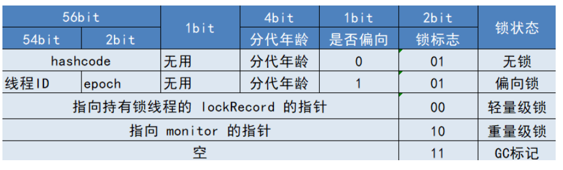

## synchronized 底层是如何实现的

以下内容使用`syn`作为synchronized的简称。

在jdk1.6之前syn一直都是重量级别的实现，使用的是系统层提供的锁机制，也是后来所说的重量级锁。加锁解锁都会涉及到用户态内核态的切换。

首先在Java里面使用syn锁的话，有三种不同的场景。

1. 锁静态方法,多线程竞争的对象就是类的class对象。
2. 锁实例方法，多线程竞争的对象就是实例对象。
3. 锁代码块，多线程竞争根据自己指定的对象

当关键字修饰的是同步方法，此方法被标记为`ACC_SYNCHRONIZED`，如果是同步代码块，那么代码块被`monitorEnter,monitorExit`包围，在异常的地方也会有一个`monitoExit`。他们本质上是一样的，JVM在执行同步方法的时候遇见`ACC_SYNCHRONIZED`标记为，就知道这是一个同步方法，会使用`monitorEntor,Exit`包裹方法。所以他们本质上是一样的。`MonitorEnter/Exit`指令的意思并不是说一定要争夺的就是对象对应的Monitor对象，他要表达的意思仅仅是要开始加锁解锁的意思。

锁的信息存储在对象头的Mark word里面。如果是重量级锁的话，MarkWord存储的是指向堆中monitor对象的指针。

我发现大部分锁都是这么实现的。要有一个持有者对象，实现可重入要有一个计数器，维护等待锁被阻塞的线程至少有一个队列。

在Monitor对象里面，它使用了两个链表来维护被阻塞的线程。`ContentionList`单链表,`EntryList`双链表,使用`WaitSet`保存调用`Object.wait`方法的线程。当一个线程尝试获取锁，如果锁已经被占用，（在这之前有一个自适应循环继续尝试获取锁，毕竟阻塞线程入队再唤醒开销还是有点大）则将这个线程封装成一个`ObjectWaiter`对象插入到`ContentionList`的队列，然后暂停这个线程。当持有锁的线程释放锁之前 ，会将`ContentionList`里面的所有元素移动到`EntryList`里面去，并唤醒`EnteryList`里面的头节点作为假定继承人来获取锁，成功了就是成功了，失败了就继续回去。这也是非公平锁的一种体现。

而WaitSet是在调用`wait`方法时从`EntryList`（肯定在这里呀，因为调用`wait`的时候是在锁的环境下调用的，而且是放弃了锁。）里面移动至`WaitSet`集合里面，在唤醒的时候再将节点迁移到`EntryList`里面。也可以推断出，如果当前锁如果是偏向锁或者轻量级锁调用`wait`方法时候，锁会膨胀，因为偏向锁和轻量级锁没有`monitor`对象。

## 锁的升级过程

**轻量级锁**

因为重量级锁的实现用到了系统底层的互斥量，涉及到了用户态内核态的切换，消耗太大。如果在一些场景下，多个线程是在不同的时间段进入同步代码块，此时根本不需要阻塞线程，自然也就不需要Monitor对象。所以JVM有了轻量级锁的实现。

**轻量级锁与重量级锁的不同**在于：

第一：markWord里面。轻量级锁的标记为是00，重量级锁是10.

第二：重量级锁指向的是堆中Monitor对象的指针，而轻量级锁指向的是栈帧中的lockRecord的指针。

第三：重量级锁的可重入是利用Moniyor的计数器实现的，而轻量级锁是通过入栈多余的null对象实现。

每一个线程来获取轻量级锁，首先判断对象是有锁状态还是无锁状态，如果是无锁状态，则在当前线程栈中开辟以合LockRecord的空间来拷贝一份对象的MarkWord。再利用CAS将对象的MarkWord替换为执行自己LockRecord的指针。如果是有锁状态，则会判断锁这个MarkRecord是不是指向的自己，是就入栈一个null对象，不是的话，说明此时有其他的线程持有了锁，那么虚拟机会将这个锁膨胀为重量级锁，将此线程包装成等待节点放入`ContenttionList`。

解锁也是如此，解锁也是通过CAS比较来解锁，成功了就解锁或者是减去一个null对象，根据上面说的，如果在持有锁的期间有其他线程来过，虚拟机会将锁膨胀，此时解锁CAS会操作失败，那么此时他也懂了，此时已经是重量级锁的状态了导致CAS失败，那么就执行重量级锁的解锁逻辑。

**偏向锁**

甲骨文官方认为大多数后甚至都是同一个线程在使用一个锁，此时如果获取锁的话，连CAS都可以省去。

如果虚拟机开启了偏向锁的设置的话，线程请求获取锁，如果是无锁状态的话，第一次操作还是会使用CAS将自己的线程ID替换MarkWord的空间，如果操作成功，之后这个线程每次来获取锁都不需要CAS操作了。只需要判断线程号和epoch的值便可以获取锁。而如果在偏向锁期间有其他的线程来获取锁，那么会先执行偏向锁的撤销操作，将epoch值递增，升级成轻量级锁。撤销操作需要找到全局安全点**，保证正在执行的持有此锁的线程不能丢失了锁（因为比较要同时比较线程ID和epoch）**，遍历所有线程的Java栈，找出该类已加锁的实例，并且将它们标记字段中的 epoch 值加 1。撤销次数达到一定阈值的时候，这个类不会再有偏向锁模式了。

epoch字段的作用

判断是第几代偏向锁，每次撤销偏向锁需要递增epoch的值。达到一定的阈值不再拥有偏向锁模式。

**补一张图**

00 ：轻量级锁

 01：偏向锁101  无锁001

10：重量级锁

11：GC标记

## 锁的优化

> 除了锁升级外，还有一些优化

**自旋锁与自适应自旋**

阻塞和唤醒需要切换到内核态，所以尽量避免这种情况的发生。那就是自旋一会儿，看看持有锁的线程是否很快就会释放，至于自旋多久，这个就是经验问题。在重量级锁的代码里面，就有获取失败尝试自旋后在获取的逻辑。

**锁消除**

根据逃逸分析技术判断在堆上的数据不会逃逸出被其他线程访问，那么就当作栈上数据对待。认为是线程私有的，同步加锁无需进行。

**锁粗化**

如果一系列的加锁操作都是针对同一个对象的反复加锁和解锁，甚至加锁操作是放在循环体内，那么可以使用锁粗化的技术将加锁范围拓展。减少加锁解锁的消耗。

